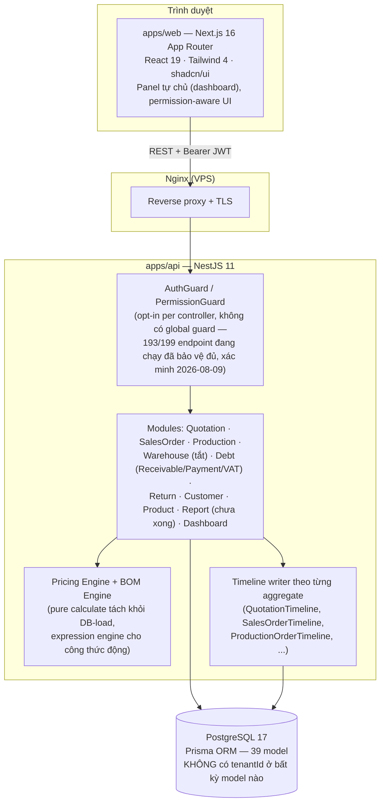
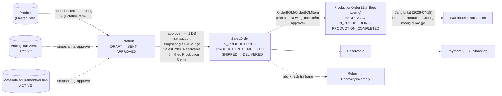
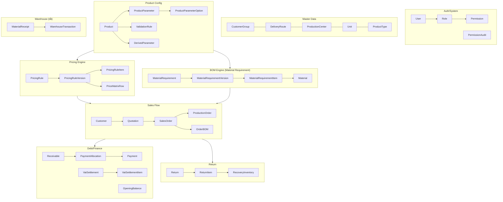
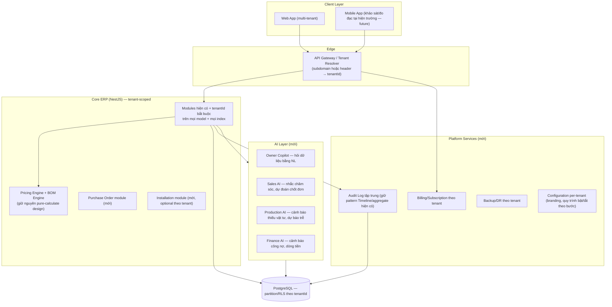

# ERP Architecture Audit — ERP Engine (Xưởng Rèm Thăng Long)

> **Người thực hiện:** Claude Code, đóng vai Principal Software Architect / ERP Solution Architect / Domain Expert ngành rèm-bạt-mái hiên-cửa lưới / Product Architect SaaS B2B.
> **Ngày:** 2026-08-07
> **Phạm vi:** Toàn bộ repository `ERP-engine` — `apps/api` (NestJS + Prisma + PostgreSQL), `apps/web` (Next.js), `knowledge/`, `workbench/`.
> **Phương pháp:** Đọc trực tiếp `schema.prisma` (39 model), service layer của Quotation/SalesOrder/Production/Pricing Engine/BOM Engine, cấu trúc frontend, và toàn bộ tài liệu nội bộ trong `knowledge/project/` và `workbench/`. Mọi nhận định trong tài liệu này bám vào bằng chứng cụ thể (tên file, tên model, tên method) — không suy đoán nghiệp vụ ngoài phạm vi đã đọc.

---

## Lưu ý về khung tham chiếu

Tài liệu này audit trên **hai lớp mục tiêu khác nhau**, cần tách bạch rõ để không hiểu nhầm:

1. **Lớp hiện tại (thực tế hợp đồng):** ERP Engine hiện là dự án outsource cho **một khách hàng duy nhất** — Xưởng Rèm Thăng Long, 3 người dùng nội bộ, hợp đồng 69.000.000 VNĐ / 20 ngày (`knowledge/project/01-tong-quan-du-an.md`). Phạm vi hợp đồng gốc **loại trừ tường minh**: Mobile App, Website bán hàng, AI, đồng bộ phần mềm kế toán. Hệ thống không có khái niệm multi-tenant vì chưa từng được yêu cầu.
2. **Lớp tầm nhìn (theo yêu cầu audit):** Phần 1, Phần 9 và Phần 10 của tài liệu này đánh giá tiềm năng thương mại hóa thành sản phẩm SaaS đa khách hàng cho ngành rèm/bạt/mái hiên/cửa lưới nói chung. Đây là **đề xuất chiến lược mang tính tầm nhìn**, không phải backlog đã được khách hàng hiện tại đặt hàng hay đã cam kết trong roadmap. Mọi khuyến nghị ở các phần này cần một quyết định kinh doanh riêng (build sản phẩm mới / fork / thương mại hóa) trước khi trở thành task kỹ thuật.

Việc so sánh 2 lớp này chính là giá trị cốt lõi của audit: hệ thống hiện tại có nền móng kiến trúc (Workflow Engine, Snapshot, Versioning) tốt hơn nhiều so với một dự án outsource 20 ngày thông thường — đây là tài sản kỹ thuật thực sự đáng để đầu tư tiếp thành sản phẩm.

---

## Executive Summary

ERP Engine không phải là một CRUD app được lắp ráp nhanh. Đội ngũ đã tự đặt ra và tuân thủ nghiêm túc 4 kỷ luật kiến trúc mà phần lớn ERP outsource cỡ nhỏ bỏ qua: **Action-Driven Workflow** (không cho sửa status tay ngoài Manual Override có audit đầy đủ), **Snapshot triệt để** tại mọi điểm chuyển chứng từ (Quotation → SalesOrder → ProductionOrder), **Versioning tường minh** cho Pricing Rule và Material Requirement (BOM), và **Timeline theo từng aggregate** thay vì một bảng log chung chung. Đây là nền móng đúng của một ERP thật, không phải một app quản lý.

Điểm yếu lớn nhất không nằm ở thiết kế nghiệp vụ mà ở **biên giới sản phẩm**: hệ thống được xây cho đúng một xưởng, với đúng một quy trình (không khảo sát, không lắp đặt, không nghiệm thu — theo lựa chọn có chủ đích của khách hàng hiện tại), và **hoàn toàn không có khái niệm multi-tenant**. Ngoài ra có 2 khoảng trống kỹ thuật cụ thể, đo được: (1) module Kho đã code xong nhưng đang **tắt có chủ đích**; (2) module Báo cáo backend+frontend **chưa hoàn thành** dù đã có nhiều trang FE placeholder. (Một ghi nhận cũ trong `workbench/roadmap.md` — 133 endpoint thiếu guard — đã được xác minh lại và **không còn đúng**: hiện 193/199 endpoint đang chạy có đủ AuthGuard+PermissionGuard, phần còn lại là public/self-service có chủ đích. Xem Phần 6 và mục "Cập nhật xác minh" cuối tài liệu.)

Xếp theo thang ERP chuẩn (SAP/Odoo/ERPNext), hệ thống đang ở **giữa Level 2 và Level 3** — vượt xa "business application" nhờ Workflow Engine và Snapshot, nhưng chưa tới "ERP" đúng nghĩa vì thiếu Purchase module đầy đủ, thiếu General Ledger/kế toán, và Inventory đang tắt. Để trở thành "hệ điều hành ngành rèm/bạt/mái hiên" (Level 4, đa khách hàng), cần một quyết định đầu tư riêng: retrofit multi-tenant, xây lớp AI, và đóng gói thành sản phẩm SaaS — không phải một vài task vá lỗi.

---

## Kiến trúc hệ thống hiện tại

**Sơ đồ chuỗi chứng từ (Snapshot & Document Design — đúng nguyên tắc #7 CLAUDE.md, đã xác nhận trong code):**

**Domain model rút gọn (39 model, nhóm theo miền nghiệp vụ):**

---

## Kiến trúc đề xuất (tầm nhìn SaaS đa khách hàng + AI)

> Lưu ý lại: đây là kiến trúc **mục tiêu**, không phải kiến trúc cần làm ngay cho khách hàng hiện tại.

---

## Phần 1 — Product Architecture

### 1. Vấn đề kinh doanh đang giải quyết

Xưởng rèm/bạt/mái hiên/cửa lưới cỡ nhỏ-vừa vận hành bằng Excel + Zalo + trí nhớ chủ xưởng. Vấn đề cốt lõi không phải "thiếu phần mềm quản lý" mà là **giá bán và định mức vật tư phụ thuộc vào công thức theo kích thước** (rèm 3m2 khác 5m2 không phải tuyến tính đơn giản — có bậc giá, có điều kiện theo chất liệu/màu khung). Phần mềm kế toán/CRM chung (MISA, KiotViet) không mô hình hóa được bài toán này vì sản phẩm với họ là SKU cố định, không phải cấu hình theo thông số. Đây chính xác là lý do Pricing Engine và BOM Engine formula-based (Phần 4, 5) tồn tại — chúng giải đúng vấn đề mà sản phẩm CRUD generic không giải được.

### 2. Định vị sản phẩm nên là gì

Không nên định vị là "phần mềm quản lý xưởng" (cạnh tranh trực diện với KiotViet/Sapo, thua về hệ sinh thái/thương hiệu) mà nên định vị là **"Configure-Price-Quote (CPQ) + Production Engine chuyên ngành rèm/bạt/mái hiên/cửa lưới"** — lớp giá trị nằm ở Pricing Engine + BOM Engine formula-based, không nằm ở CRUD khách hàng/kho. Đây là ngách hẹp, ít đối thủ trực tiếp, nhưng đúng nỗi đau thật (báo giá sai công thức → lỗ đơn, hoặc báo giá chậm → mất khách).

### 3. Điểm khác biệt cạnh tranh

| Đối thủ | Điểm mạnh của họ | Khoảng trống họ để lại (cơ hội của ERP Engine) |
|---|---|---|
| **Odoo** | Hệ sinh thái module đầy đủ (kế toán, CRM, MRP), open-source, customize sâu | MRP/BOM của Odoo là BOM tĩnh (danh sách cố định theo variant), không có engine tính công thức theo kích thước động như rèm/bạt cần; customize để làm được việc này tốn effort tương đương xây riêng |
| **MISA** | Mạnh kế toán/hoá đơn điện tử, tuân thủ pháp lý VN tốt | Không có khái niệm sản phẩm cấu hình theo thông số, không có Production Order theo xưởng, không có BOM engine |
| **KiotViet** | UX bán lẻ cực nhanh, phổ biến, rẻ | Là phần mềm bán lẻ SKU cố định — hoàn toàn không mô hình hóa được "giá phụ thuộc công thức kích thước" |
| **ERP sản xuất khác (generic MRP)** | BOM/MRP chuẩn công nghiệp, hoạch định capacity | Thường là BOM tĩnh theo sản phẩm cố định (linh kiện rời rạc: số lượng nguyên/không đổi theo kích thước) — ngành may đo/rèm/bạt cần BOM *hàm số* theo width/height/area, generic MRP không có sẵn |
| **BlindMatrix** (phần mềm quốc tế chuyên ngành rèm/mành) | Đã giải đúng bài toán cấu hình sản phẩm theo kích thước + pricing matrix, chuyên sâu ngành | Sản phẩm ngoại, giá cao, không có sẵn nghiệp vụ công nợ/VAT/quy trình đặc thù thị trường VN (công nợ 30 ngày, thanh toán tiền mặt, hoá đơn VAT settlement) — đây chính là khoảng trống ERP Engine đang lấp đúng, thấy rõ qua module `debt` khá phức tạp (FIFO allocation, VatSettlement cho khách trả tiền mặt sau xuất hoá đơn) |

**Kết luận định vị:** ERP Engine gần với triết lý BlindMatrix (CPQ chuyên ngành theo công thức kích thước) hơn là gần Odoo/MISA/KiotViet (ERP/CRM/POS tổng quát), nhưng được bản địa hóa sâu cho quy trình công nợ và VAT của thị trường Việt Nam — đây là lợi thế cạnh tranh thật, không phải marketing.

### 4. Nếu thương mại hóa SaaS, cần bổ sung gì

Xem chi tiết Phần 10, tóm tắt nhanh: multi-tenant (hiện 0%), Purchase module đầy đủ, bật lại Warehouse, hoàn thiện Report, billing/subscription, self-service onboarding (hiện mọi cấu hình Pricing Rule/BOM đều do dev cấu hình tay qua seed script — cần UI cấu hình cho tenant tự làm), và một bộ "quy trình mẫu" có thể bật/tắt theo từng bước (khảo sát, lắp đặt, nghiệm thu — hiện đang hard-code là "không có" cho khách hàng này).

---

## Phần 2 — Business Domain Architecture

### Domain model hiện tại (từ schema thực tế)

Đã có đầy đủ và snapshot chuẩn: **Customer, Quotation, SalesOrder, Product, BOM (qua MaterialRequirement), Material, Production (ProductionOrder), Payment, Receivable**. Reporting có module riêng dù backend chưa hoàn thiện.

### Entity đang thiếu

- **Lead/Opportunity**: không tồn tại. Quy trình hiện tại đi thẳng `Customer → Quotation`, đúng với thực tế "khách cũ/Zalo/điện thoại, không cần khảo sát trong đa số trường hợp" (`02-quy-trinh-nghiep-vu.md`). Đây là lựa chọn nghiệp vụ có chủ đích của khách hàng hiện tại, không phải thiếu sót — nhưng nếu bán SaaS cho xưởng khác có phễu bán hàng dài hơn (nhiều khách hỏi giá nhưng không chốt), thiếu Lead/Opportunity sẽ mất khả năng đo tỷ lệ chuyển đổi và làm CRM.
- **Measurement (đo đạc/khảo sát)**: không tồn tại như một entity riêng — kích thước nhập trực tiếp vào `QuotationItemParameter`. Với khách hàng hiện tại (không khảo sát trực tiếp) là đủ; với ngành rèm/mái hiên nói chung (nhiều xưởng bắt buộc khảo sát tại nhà trước khi báo giá) đây là entity thiếu thật sự — cần tách để lưu lịch sử đo đạc, ảnh hiện trường, người đo, độc lập với Quotation.
- **Installation (lắp đặt)**: không tồn tại — nghiệp vụ hiện tại xác nhận "không cần quản lý lắp đặt, không cần biên bản nghiệm thu". Đây là gap rõ nếu mở rộng sang mái hiên/cửa lưới quy mô lớn hơn, nơi lắp đặt là công đoạn tính phí và cần lịch nhân công riêng.
- **Purchase (mua hàng từ NCC)**: không có module Purchase Order độc lập — chỉ có `MaterialReceipt` (nhập kho một chiều), không có quy trình đề nghị mua → chọn NCC → PO → nhận hàng → đối chiếu công nợ phải trả NCC. `Payable` (công nợ phải trả) hoàn toàn không có — chỉ có `Receivable` (phải thu).

### Entity gộp sai / cần xem lại

- **Không phát hiện entity nào bị gộp sai về mặt thiết kế** — schema tách domain khá kỷ luật (ví dụ `SalesOrderItemParameter` tách riêng khỏi `SalesOrderItem` thay vì nhét vào 1 cột JSON, giữ được khả năng query/validate từng tham số). Điểm cần lưu ý không phải "gộp sai" mà là **field tham chiếu phẳng không có `@relation`** dùng có chủ đích cho báo cáo (`Receivable.customerId`, `Return.customerId`...) — đây là trade-off đã ghi chú rõ trong code, chấp nhận được theo đúng nguyên tắc #13 CLAUDE.md (Derived Data phục vụ hiệu năng đọc).

### Relationship chưa chuẩn ERP

- **SalesOrder → ProductionOrder là 1-nhiều theo Production Center**, không phải 1-1: đúng với thực tế 1 đơn hàng có thể sản xuất ở nhiều xưởng khác nhau — thiết kế này chuẩn hơn nhiều ERP generic vốn giả định 1 order = 1 production run.
- **Không có Payable/Vendor domain**: quan hệ NCC ↔ Material ↔ MaterialReceipt hiện chỉ là ghi nhận nhập kho, không có entity `Vendor/Supplier` — nếu nhập kho có nhiều NCC khác giá khác nhau, hiện không model hoá được "NCC nào cung cấp lô này giá bao nhiêu" như một quan hệ bậc nhất.
- **ProductionOrder không có Manual Override** trong khi Quotation và SalesOrder đều có — không nhất quán về mặt "mọi chứng từ đều nên có cơ chế override có audit" theo đúng nguyên tắc #5 CLAUDE.md.

---

## Phần 3 — Nghiệp vụ ngành rèm/bạt (audit theo workflow chuẩn)

| Bước chuẩn ngành (yêu cầu audit) | Có trong ERP Engine? | Ghi chú |
|---|---|---|
| Lead | ❌ Không | Bỏ qua có chủ đích — khách hiện tại không cần |
| Khảo sát | ❌ Không | "Không cần khảo sát trực tiếp trong đa số trường hợp" — theo `02-quy-trinh-nghiep-vu.md` |
| Đo kích thước | ⚠️ Có nhưng gộp vào Quotation | Nhập trực tiếp làm tham số dòng báo giá, không phải entity độc lập có lịch sử |
| Báo giá | ✅ Đầy đủ | Pricing Engine formula-based, versioning, snapshot — vượt chuẩn cho quy mô 20 ngày dev |
| Chốt đơn | ✅ Đầy đủ | `Quotation.approve()` — action-driven, 1 transaction |
| Đặt cọc | ⚠️ Một phần | Ghi nhận qua `Payment`/`Receivable`, không có entity "Deposit" tách riêng để phân biệt cọc vs thanh toán cuối — quy trình `02-quy-trinh-nghiep-vu.md` chỉ nói "có thể đặt cọc hoặc bán công nợ", không có luật ràng buộc % cọc tối thiểu |
| Thiết kế | ❌ Không có bước riêng | Với rèm/bạt tiêu chuẩn không cần — sản phẩm đã có ProductParameter định sẵn |
| Sản xuất | ✅ Đầy đủ | ProductionOrder action-driven, nhóm theo xưởng, timeline đủ |
| Xuất kho | ⚠️ Có code, đang tắt | `WarehouseTransaction`/`issueForProductionOrder()` tồn tại nhưng bị vô hiệu hoá 2026-07-18 theo quyết định nghiệp vụ (chưa cần quản lý tồn kho) |
| Lắp đặt | ❌ Không | Xác nhận rõ trong tài liệu: "không cần quản lý lắp đặt" |
| Bảo hành | ⚠️ Một phần | `02-quy-trinh-nghiep-vu.md` mục 5 có trạng thái "Bảo hành" trong sơ đồ tổng thể, nhưng `SalesOrderStatus` trong schema thực tế dừng ở `DELIVERED` — không thấy state `WARRANTY` trong enum đã đọc. Đây là **khoảng lệch giữa tài liệu nghiệp vụ và schema thực tế**, nên xác minh lại với khách hàng có đúng là chưa triển khai hay đã đổi thiết kế. |
| Hàng hoàn | ✅ Đầy đủ | `Return`/`ReturnItem`/`RecoveryInventory` — có state machine PROCESSING/COMPLETED đầy đủ |

**Kết luận Phần 3:** Hệ thống cover đúng những gì khách hàng hiện tại thực sự cần (8/10 bước theo tài liệu nghiệp vụ nội bộ), không thừa không thiếu — đúng tinh thần "Chỉ thực hiện đúng Task" của CLAUDE.md. Domain cần tách rõ nhất nếu mở rộng SaaS: **Measurement** (đo đạc) và **Installation** (lắp đặt) — hai bước phổ biến ở các xưởng khác nhưng bị loại trừ tường minh khỏi phạm vi hợp đồng hiện tại. Điểm cần làm rõ ngay với khách hàng (không phải audit tự quyết): trạng thái Bảo hành có thật sự chưa triển khai hay tài liệu `02-quy-trinh-nghiep-vu.md` đã lỗi thời.

---

## Phần 4 — Pricing Engine

### Cách tính giá (đã xác nhận trong `pricing-engine.service.ts`)

Pipeline 2 lớp: `loadConfig()` (đọc DB) tách biệt hoàn toàn khỏi `calculatePrice(config, rawParams)` (pure function, unit-test được không cần DB) — đây là thiết kế đúng chuẩn engine, hiếm gặp ở dự án outsource 20 ngày.

**Validate → Derive (tính tham số dẫn xuất) → Normalize (áp min-dimension/min-value/min-area/step-rule có điều kiện) → Matrix lookup (tùy chọn, cho `unitPrice`) → Formula expression (`evaluateNumber`, có thể tham chiếu `unitPrice`) → Round (theo `RoundType`).**

Điểm thiết kế đáng chú ý: **"Billable ≠ Actual"** — số đã normalize (dùng để tính giá) không bao giờ ghi đè lên số gốc khách cung cấp; BOM Engine tiêu thụ số gốc, Pricing Engine tiêu thụ số đã chuẩn hóa. Tách đúng 2 khái niệm mà nhiều hệ thống nhập nhằng: "khách trả tiền theo mức giá làm tròn" khác với "vật tư cắt theo kích thước thật".

### Version giá

`PricingRule → PricingRuleVersion (versionNumber, VersionStatus DRAFT/ACTIVE/ARCHIVED) → PricingRuleItem/PriceMatrixRow`. Chỉ 1 version `ACTIVE` được load cho báo giá mới; version `DRAFT` load được theo ID riêng cho mục đích xem trước (admin preview) — đúng nguyên tắc #8 CLAUDE.md (Versioning, không sửa dữ liệu đang dùng).

### Công thức

Matrix và formula **không loại trừ nhau** — sản phẩm dùng price matrix vẫn phải có formula tiêu thụ biến `unitPrice` từ kết quả tra bảng. Thiết kế này linh hoạt: matrix cho phần "giá theo bậc" (thường gặp ở rèm cuốn), formula cho phần "công thức nhân diện tích/phụ phí" (thường gặp ở bạt/mái hiên).

### Discount

Discount xử lý ở lớp Quotation (không phải Pricing Engine) — có `surchargeExpression` riêng, tính **sau discount**, cố tình loại khỏi `systemPrice`/`rawPrice` để không làm sai lệch % chiết khấu hiển thị cho khách.

### Approval

Không có cơ chế approval workflow riêng cho mức chiết khấu (vd: chiết khấu > X% cần cấp trên duyệt) trong phạm vi đã đọc — chiết khấu là field tự do trên `QuotationItem`, giới hạn (nếu có) nằm ở tầng validate. Đây là khoảng trống nếu doanh nghiệp lớn hơn cần kiểm soát chiết khấu theo cấp bậc nhân viên.

### Snapshot giá lúc báo giá

Xác nhận permanent: `QuotationItem` lưu `pricingRuleVersionId`, `systemPrice`, `unitPrice`, `finalPrice` tại thời điểm approve, có comment rõ trong code "Approve có thể tính lại từ config đã snapshot" — đúng tuyệt đối nguyên tắc #7 CLAUDE.md.

### Đánh giá: Pricing Engine có đủ cho rèm / bạt / mái hiên / cửa lưới không?

**Đủ về mặt cơ chế tính toán** — formula-based + matrix + condition-gated normalize đã đủ tổng quát cho cả 4 nhóm sản phẩm (rèm theo m2, bạt theo công thức khung+bạt, mái hiên có phụ kiện motor, cửa lưới theo khung nhôm). **Chưa đủ về mặt quản trị** nếu thương mại hóa: thiếu approval workflow theo cấp chiết khấu, thiếu khả năng A/B test hoặc so sánh version giá trước khi kích hoạt (hiện chỉ xem preview theo ID, không có diff UI).

---

## Phần 5 — BOM Engine

### 1. BOM tĩnh hay động?

**Động (dynamic)**, xác nhận trong `bom-engine.service.ts`: pipeline **Filter (mỗi dòng có `condition` chọn biến thể vật tư, vd `maukhung == "cafe"`) → Formula (`evaluateNumber` theo width/height/area/tham số dẫn xuất) → Waste% → Round → nhân số lượng**. Không phải danh sách linh kiện cố định như BOM ngành lắp ráp cơ khí truyền thống.

### 2. Có tính theo chiều rộng/chiều cao/diện tích/hao hụt/phụ kiện không?

Có đủ: width/height/area qua expression engine (dùng chung engine với Pricing), hao hụt qua field `waste%` riêng từng dòng vật tư, phụ kiện qua các dòng `MaterialRequirementItem` có `condition` riêng (chọn đúng phụ kiện theo biến thể sản phẩm).

### 3. Có thể sinh Production Order tự động không?

**Có, nhưng gián tiếp** — BOM Engine tự nó không sinh ProductionOrder. `Quotation.approve()` là nơi điều phối: gọi BOM Engine cho từng item → tạo `OrderBOM`/`OrderBOMItem` (snapshot) → tính `plannedCost` → nhóm item theo `productionCenterId` → sinh 1 ProductionOrder cho mỗi nhóm xưởng, toàn bộ trong 1 DB transaction. Về chức năng là "tự động", nhưng về kiến trúc BOM Engine đúng vai trò tính toán thuần túy (calculate), không đảm nhiệm orchestration — tách vai trò rõ ràng, dễ test.

### Đề xuất kiến trúc BOM tốt hơn

- **Bổ sung Manual Override cho ProductionOrder** (đồng bộ với Quotation/SalesOrder) — hiện quản đốc không có đường chính thức để điều chỉnh vật tư thực tế phát sinh ngoài BOM tính toán (vd vật tư lỗi phải cắt lại) mà không đi vòng qua sửa dữ liệu tay.
- **Tách BOM Engine khỏi Pricing Engine ở tầng expression** (hiện dùng chung `evaluateNumber`) thành 2 context riêng nếu cần audit riêng công thức giá vs công thức vật tư — hiện tại việc dùng chung engine là hợp lý cho quy mô này, chỉ nên tách khi có nhu cầu version hóa 2 công thức độc lập với governance khác nhau (vd Pricing cần duyệt cấp cao hơn BOM).
- **Kết nối lại Warehouse khi bật lại**: khi doanh nghiệp cần quản lý tồn kho, `issueForProductionOrder()` cần được gọi lại từ `ProductionOrder.start()`, kèm theo cơ chế "đặt trước vật tư" (reserve) để tránh 2 ProductionOrder cùng giành 1 lô vật tư ít — hiện `WarehouseTransaction` có `@@unique([productionOrderId, materialId])` đảm bảo idempotent nhưng chưa có cơ chế reserve trước khi start.

---

## Phần 6 — Database Architecture

### Schema, Naming, Relations

39 model trong 1 file `schema.prisma` (1955 dòng) — naming nhất quán (PascalCase model, camelCase field, snake_case ở DB level qua `@map`). Naming rõ ràng, dễ đọc, không có ký hiệu viết tắt khó hiểu.

### Index

Đánh index khá dày cho các trường lọc dashboard/báo cáo thường dùng: `status`, `dueDate`, `createdAt`, `expectedDeliveryDate`, tổ hợp `transactionType+direction+createdAt`. Đây là dấu hiệu team đã nghĩ tới hiệu năng đọc từ đầu, không phải thêm index vá sau khi chậm.

### Transaction

`$transaction` của Prisma dùng nhất quán cho mọi thao tác nhiều bảng cùng lúc (rõ nhất ở `Quotation.approve()` — sinh SalesOrder + Receivable + nhiều ProductionOrder + nhiều Timeline trong 1 transaction). Đây là điểm mạnh về data integrity hiếm gặp ở dự án quy mô nhỏ.

### Data integrity

3 CHECK constraint viết tay ngoài khả năng biểu diễn của Prisma: `receivables_remaining_amount_check` (`>=0`), `opening_balances_*_check`, `vat_settlement_items_source_check` (dùng `num_nonnulls` đảm bảo XOR giữa `receivable_id`/`opening_balance_id`). Đây chính là cơ chế chống thu nợ vượt khi có request đồng thời — đã được CLAUDE.md ghi nhận là ngoại lệ đã duyệt, không được "sửa lại cho đúng nguyên tắc".

### Technical debt cụ thể (đã xác nhận, không suy đoán)

| # | Debt | Bằng chứng | Mức độ |
|---|---|---|---|
| 1 | ~~133 endpoint thiếu guard~~ — **đã lỗi thời, xác minh lại 2026-08-09** | Quét trực tiếp 33 controller đang mount: 193/199 endpoint có đủ `AuthGuard`+`PermissionGuard`. Còn lại: `GET /health`, `POST /auth/login` (bắt buộc public), `POST /auth/logout` (xác nhận stateless, không side-effect cần bảo vệ), `GET /settings/branding` (public có chủ đích, nay đã gắn `@Public()` tường minh thay vì chỉ dựa comment); `GET /auth/me`, `POST /auth/change-password` chỉ cần AuthGuard (self-service, có chủ đích) | 🟢 Đã xử lý — xem "Cập nhật xác minh" cuối tài liệu |
| 2 | `packages/{config,types,utils}` rỗng (chỉ `.gitkeep`) | Glob xác nhận | 🟡 Trung bình — code có thể đang duplicate type/util giữa `apps/api` và `apps/web` |
| 3 | Không có multi-tenancy | Full-text search schema xác nhận không có `tenantId`/`companyId`/`organizationId` ở bất kỳ model nào | 🟢 Chưa phải nợ với khách hàng hiện tại — chỉ là gap nếu thương mại hóa |
| 4 | Không có Purchase module | Không tìm thấy model/service Purchase Order | 🟡 Trung bình — chỉ có Material Receipt một chiều |
| 5 | `knowledge/project/architecture-review.md` tồn tại nhưng rỗng (0 dòng) | Đọc trực tiếp | 🟢 Thấp — có thể là nơi dự kiến chứa chính audit này |
| 6 | Module Report backend+frontend chưa hoàn thành | `workbench/roadmap.md` mục 008 chưa tick tại bản cập nhật gần nhất | 🟡 Trung bình — nhiều trang FE `reports/*` đã tồn tại nhưng backend chưa xong theo roadmap |

### Điểm khó scale

- **Single-file schema 1955 dòng**: vẫn quản lý được ở quy mô hiện tại nhưng sẽ khó review khi thêm module mới (Purchase, Installation) — nên cân nhắc tách theo domain khi file vượt ~2500-3000 dòng (Prisma hỗ trợ multi-file schema từ các bản mới).
- **Không có tenant column** đồng nghĩa retrofit multi-tenant sau này phải sửa **toàn bộ 39 model + toàn bộ composite unique/index** — đây là thay đổi lớn nhất trong toàn bộ audit này về effort, nên quyết định sớm nếu có ý định SaaS hoá (thà làm sớm khi ít dữ liệu hơn làm muộn khi đã nhiều tenant giả lập bằng cách khác).

---

## Phần 7 — ERP Standard Review

So với SAP / Odoo / ERPNext / Microsoft Dynamics, hệ thống đang ở:

**Giữa Level 2 (Business Application) và Level 3 (ERP).**

Vì sao vượt Level 2: có Workflow Engine thật (status transition qua business method có guard, không PATCH tay), có Snapshot & Versioning kỷ luật ở tầng dữ liệu (không phải chỉ ở tầng UI), có Timeline/audit trail atomic theo transaction — đây là những đặc điểm phân biệt "ERP" với "app quản lý" mà rất nhiều sản phẩm tự nhận là ERP trên thị trường VN không có.

Vì sao chưa tới Level 3 trọn vẹn: thiếu **General Ledger/kế toán tổng hợp thật** (module Debt chỉ là receivable tracking, tự nhận không sở hữu pricing/production/warehouse/GL/refund theo `knowledge/modules/debt.md`), thiếu **Purchase-to-Pay** đầy đủ (chỉ có nhập kho một chiều), Inventory đang tắt nên chưa chứng minh được vòng khép kín Vật tư→Sản xuất→Tồn kho trong thực tế vận hành.

Vì sao còn xa Level 4 (Industry Operating System): chưa có multi-tenant, chưa có AI layer, chưa có extensibility framework cho phép khách hàng/đối tác tự mở rộng (plugin, custom field, custom workflow step) mà không cần dev sửa code lõi.

---

## Phần 8 — UX Review (đóng vai chủ xưởng 10 nhân viên)

### Bao nhiêu click để tạo báo giá?

1. Menu → `/quotations` → nút "Tạo báo giá mới" (1 click)
2. Trang `/quotations/new`: chọn khách hàng qua typeahead (1 click chọn kết quả), 2 ngày đã có default tự động (+1 ngày hết hạn, +2 ngày giao hàng — không cần sửa nếu đúng), note optional → "Tạo báo giá" (1 click)
3. Redirect sang `/quotations/[id]`, bấm nút "+" (Plus icon) mở `QuotationItemDialog` để thêm từng dòng sản phẩm (1 click mở dialog + điền thông số + 1 click submit, lặp lại theo số dòng)
4. Bấm "Gửi" (Send icon) để chuyển `SENT` (1 click)

**Tổng: tạo báo giá trống chỉ 3 click**, thêm mỗi dòng sản phẩm +2 click. Đây là UX rất gọn — đúng tinh thần tối thiểu field bắt buộc (chỉ khách hàng là required). Điểm cộng thật sự, không phải nhận xét xã giao.

### Bao nhiêu click để biết đơn đang ở đâu?

Từ Dashboard (trang chủ) → khối "Sản xuất" hiển thị tiến độ + xưởng bận nhất → click drill-down thẳng vào đơn cụ thể: ước tính 2 click từ trang chủ tới chi tiết đơn hàng, nhờ có `GET /dashboard/overview` gộp 1 lần gọi API duy nhất thay vì nhiều lần fetch rời rạc (thiết kế hiệu năng tốt, xác nhận qua comment code + `workbench/roadmap.md` mục 009).

### Dashboard có đúng nhu cầu không?

Cấu trúc hiện tại (`TodaySummaryBar → AlertsPanel → SalesOverviewPanel → ProductionOverviewPanel → DebtOverviewPanel → ReturnOverviewPanel`) đúng thứ tự ưu tiên thông tin của chủ xưởng nhỏ: việc hôm nay → cảnh báo cần xử lý ngay → kinh doanh → sản xuất → tiền → hàng hoàn. Mỗi panel tự permission-gate (ẩn nếu user không có quyền module đó) — thiết kế đúng cho ERP nhiều vai trò dùng chung 1 dashboard.

### Có thông tin quan trọng nào bị ẩn?

Ba điểm đáng lưu ý:
1. **Cảnh báo thiếu vật tư không hiển thị được** vì Warehouse đang tắt — quản đốc không biết trước khi bắt đầu sản xuất là có đủ vật tư hay không (trước đây có tính năng chặn Start khi thiếu tồn, giờ đã gỡ theo quyết định nghiệp vụ).
2. **Không có cảnh báo chiết khấu bất thường** trên dashboard dù dữ liệu `discountPercent` đã có sẵn ở `QuotationItem` — chủ xưởng khó phát hiện nhân viên chiết khấu quá tay nếu không chủ động vào từng báo giá xem.
3. Roadmap tự ghi nhận đã phát hiện và sửa 1 bug rò dữ liệu thật (`GET /dashboard/overview` từng không lọc `alerts` theo quyền, lộ dữ liệu công nợ/kho cho user chỉ có quyền xem dashboard) — cho thấy quy trình QA của team có phát hiện lỗi thật qua Playwright, đáng ghi nhận là điểm mạnh về kỷ luật kiểm thử, không phải điểm yếu.

---

## Phần 9 — AI Architecture (đề xuất tầm nhìn)

> Nhắc lại: nằm ngoài phạm vi hợp đồng hiện tại ("Chưa triển khai: AI" — `01-tong-quan-du-an.md`). Đề xuất dưới đây cụ thể hóa theo đúng data model đã có, để khi có quyết định đầu tư thì không phải thiết kế lại từ đầu.

**AI Sales Assistant** — dựa trên `Quotation.expiryDate` + `QuotationTimeline`: cảnh báo báo giá sắp hết hạn chưa được khách phản hồi; dự đoán khả năng chốt đơn dựa trên pattern lịch sử (thời gian từ SENT → APPROVED theo từng khách/nhóm khách qua `CustomerGroup`).

**AI Production** — dựa trên `OrderBOM`/`OrderBOMItem` + `Material` (khi Warehouse bật lại): cảnh báo thiếu vật tư trước khi đơn tới hạn sản xuất; dự báo trễ đơn dựa trên tốc độ hoàn thành lịch sử của từng `ProductionCenter` so với `expectedDeliveryDate`.

**AI Finance** — dựa trên `Receivable` + `debtLimitSnapshot`/`debtTermDaysSnapshot`: cảnh báo công nợ vượt hạn mức sớm hơn (dự báo dựa trên pattern thanh toán của khách, không chỉ cảnh báo khi đã vượt).

**AI Owner Copilot** — hỏi dữ liệu bằng ngôn ngữ tự nhiên: khả thi kỹ thuật cao vì schema đã có `code` chuẩn hóa và tách domain rõ ràng — một lớp text-to-SQL hoặc text-to-API có thể map câu hỏi tự nhiên sang đúng module (Quotation/SalesOrder/Debt) tương đối an toàn nhờ ranh giới domain đã rõ, miễn là giới hạn quyền truy vấn theo `PermissionGuard` sẵn có.

**Điều kiện tiên quyết trước khi làm AI:** lớp guard/permission đã đủ tốt để AI truy vấn an toàn (xác minh 2026-08-09); điều kiện thật sự còn thiếu là bật lại Warehouse — AI Production/Finance vô nghĩa nếu dữ liệu nguồn (tồn kho) không được duy trì.

---

## Phần 10 — Scale to SaaS (1000 xưởng)

| Hạng mục | Hiện trạng | Đánh giá |
|---|---|---|
| **Multi-tenant** | Không có — 0% | Cần retrofit toàn bộ 39 model, đây là hạng mục lớn nhất, nên quyết định sớm |
| **Permission** | Có Role/Permission/RolePermission đầy đủ, `PermissionGuard` theo decorator | Nền tốt, nhưng scope hiện tại là per-user trong 1 tổ chức — cần thêm khái niệm tenant-admin vs platform-admin khi multi-tenant |
| **Role** | Có, CRUD đầy đủ qua `/settings/roles` (xác nhận đã hoàn thành milestone 010) | Đủ dùng, tái sử dụng được cho SaaS với điều chỉnh nhỏ |
| **Audit log** | Có, nhưng theo pattern Timeline riêng từng aggregate (không phải 1 bảng chung) + `PermissionAudit` cho thay đổi phân quyền | Đủ chi tiết nghiệp vụ, nhưng thiếu 1 view audit tổng hợp xuyên module cho platform-admin SaaS giám sát nhiều tenant cùng lúc |
| **Backup** | Có script (`scripts/backup/backup.sh`), thư mục `backups/` với dump định kỳ | Đủ cho vận hành 1 khách hàng; cần thiết kế lại theo tenant khi multi-tenant (backup/restore riêng từng tenant, không phải toàn DB) |
| **Billing** | Không có gì | Cần xây từ đầu — subscription, usage metering, invoice |
| **Data isolation** | Không có ở tầng DB (không RLS, không schema-per-tenant) | Rủi ro cao nhất nếu làm multi-tenant ẩu bằng cách thêm `tenantId` mà quên lọc ở 1 vài query — nên cân nhắc Postgres Row-Level Security thay vì chỉ dựa vào code tầng service |
| **Configuration** | Có `Setting` (key-value) + `Company` (singleton) | Company đang là singleton — phải đổi thành 1-1 với Tenant; Setting key-value đã sẵn cấu trúc phù hợp mở rộng theo tenant |

**Kết luận Phần 10:** hạ tầng phân quyền (Role/Permission/Audit) sẵn sàng tái sử dụng ~70-80% cho SaaS; hạ tầng dữ liệu (multi-tenant/isolation/billing) gần như phải xây mới hoàn toàn. Đây là bức tranh thực tế của một hệ thống được xây đúng cho 1 khách hàng, không phải điểm yếu thiết kế.

---

## Danh sách điểm mạnh

1. Workflow Engine thật — action-driven, guard theo status, không cho PATCH status tay.
2. Snapshot triệt để tại mọi điểm chuyển chứng từ, tuân thủ tuyệt đối nguyên tắc #7 CLAUDE.md.
3. Versioning tường minh cho Pricing Rule và Material Requirement (BOM) — không sửa dữ liệu đang dùng.
4. Manual Override có đủ reason/actor/timestamp/old-new status (Quotation, SalesOrder).
5. Timeline atomic trong cùng transaction với thay đổi trạng thái — không phải audit "best-effort".
6. Pricing Engine và BOM Engine tách pure-calculate khỏi DB-load — unit-test được, dễ audit công thức.
7. "Billable ≠ Actual" — tách bạch số dùng để tính giá và số dùng để cắt vật tư.
8. CHECK constraint DB thật (không chỉ validate ở code) chống thu nợ vượt khi có request đồng thời.
9. `$transaction` dùng nhất quán cho mọi thao tác đa bảng quan trọng.
10. UX tạo báo giá rất gọn (3 click cho báo giá trống) — thiết kế field tối thiểu bắt buộc.
11. Dashboard dạng panel tự chủ, tự permission-gate, tự fetch route riêng — dễ bảo trì, dễ mở rộng thêm panel mới.
12. Quy trình QA có bằng chứng thật (Playwright verify sống, đã phát hiện + sửa bug rò dữ liệu quyền qua dashboard).
13. Domain Debt/Finance khá sâu (FIFO payment allocation, payment reversal, VAT settlement cho khách trả tiền mặt) — vượt xa yêu cầu tối thiểu của 1 dự án 20 ngày.

## Danh sách điểm yếu

1. ~~133 endpoint backend chưa gắn AuthGuard/PermissionGuard~~ — xác minh 2026-08-09: đã lỗi thời, thực tế 193/199 endpoint đã bảo vệ đủ (xem Phần 6).
2. Không có multi-tenancy — retrofit sau này là thay đổi lớn nhất toàn hệ thống.
3. Warehouse đã code xong nhưng đang tắt — chuỗi Vật tư→Sản xuất→Tồn kho chưa được chứng minh vận hành thật.
4. Không có Purchase Order / Payable module — chỉ có nhập kho một chiều.
5. Module Report backend+frontend chưa hoàn thành theo roadmap.
6. `packages/{config,types,utils}` rỗng — khả năng duplicate code giữa 2 app.
7. ProductionOrder không có Manual Override, không nhất quán với Quotation/SalesOrder.
8. Không có approval workflow theo cấp chiết khấu trong Pricing.
9. Không có cảnh báo chiết khấu bất thường trên dashboard dù dữ liệu đã sẵn có.
10. Khoảng lệch giữa tài liệu nghiệp vụ (`02-quy-trinh-nghiep-vu.md` có state "Bảo hành") và schema thực tế (`SalesOrderStatus` dừng ở `DELIVERED`) — cần xác minh lại với khách hàng.
11. Không có entity Measurement/Installation độc lập — giới hạn nếu bán cho xưởng khác có khảo sát/lắp đặt.
12. Không có Row-Level Security hay cơ chế isolation ở tầng DB — rủi ro nếu multi-tenant hoá bằng cách thêm cột mà không kiểm soát chặt ở mọi query.

---

## Top 20 cải tiến quan trọng nhất

**Nhóm A — Vá ngay (ảnh hưởng khách hàng hiện tại, độ rủi ro cao):**
1. ~~Xác minh lại và vá 133 endpoint thiếu guard~~ — **hoàn thành 2026-08-09**: xác minh chỉ còn 4 endpoint không guard (health/login/logout — hợp lý — và branding — nay đã gắn `@Public()` tường minh + test), không cần vá diện rộng.
2. Hoàn thành module Report backend+frontend (đang dở theo roadmap).
3. Xác minh với khách hàng: trạng thái "Bảo hành" có còn cần triển khai không, cập nhật `02-quy-trinh-nghiep-vu.md` cho khớp thực tế.
4. Thêm Manual Override cho ProductionOrder, đồng bộ với Quotation/SalesOrder.
5. Thêm cảnh báo chiết khấu bất thường lên Dashboard (dữ liệu đã có sẵn, chỉ thiếu UI).

**Nhóm B — Nền tảng kỹ thuật (chuẩn bị cho mở rộng, chưa cần multi-tenant):**
6. Đưa `packages/types` và `packages/utils` vào dùng thật, loại bỏ duplicate type/util giữa `apps/api`/`apps/web`.
7. Tách `schema.prisma` theo domain trước khi vượt ~2500-3000 dòng.
8. Xây Purchase Order module (đề nghị mua → PO → nhận hàng → công nợ phải trả).
9. Thiết kế lại kết nối Warehouse khi bật lại: thêm cơ chế reserve vật tư trước khi `ProductionOrder.start()`.
10. Viết `knowledge/project/architecture-review.md` (hiện đang rỗng) dựa trên tài liệu audit này, giữ cập nhật định kỳ.

**Nhóm C — Chuẩn bị thương mại hóa SaaS (quyết định đầu tư riêng):**
11. Retrofit multi-tenant: thêm `tenantId` vào toàn bộ 39 model + mọi composite unique/index.
12. Đánh giá Postgres Row-Level Security thay vì chỉ lọc `tenantId` ở tầng service.
13. Xây Billing/Subscription module theo tenant.
14. Tách `Company` singleton thành 1-1 với Tenant.
15. Xây UI self-service cấu hình Pricing Rule/BOM cho tenant tự làm (hiện do dev cấu hình tay qua seed script).
16. Thiết kế "quy trình mẫu" có thể bật/tắt theo bước (khảo sát, lắp đặt, nghiệm thu) theo từng tenant.
17. Tách entity Measurement (đo đạc) và Installation (lắp đặt) độc lập, optional theo tenant.
18. Xây Backup/DR theo tenant (không phải dump toàn DB).
19. Xây lớp AI theo Phần 9, ưu tiên Production AI (thiếu vật tư/dự báo trễ) sau khi Warehouse ổn định.
20. Xây Audit Log tổng hợp xuyên module cho platform-admin giám sát nhiều tenant, giữ nguyên pattern Timeline theo aggregate ở tầng nghiệp vụ.

---

## Roadmap

### 30 ngày (vá + hoàn thiện cho khách hàng hiện tại)
- ~~Vá 133 endpoint thiếu guard~~ — hoàn thành 2026-08-09 (mục 1).
- Hoàn thành module Report (mục 2).
- Xác minh + đồng bộ trạng thái Bảo hành (mục 3).
- Manual Override cho ProductionOrder (mục 4).
- Cảnh báo chiết khấu bất thường trên Dashboard (mục 5).

### 90 ngày (nền tảng kỹ thuật, vẫn phục vụ khách hàng hiện tại)
- Dọn `packages/` dùng thật, loại duplicate code (mục 6).
- Tách schema theo domain nếu cần (mục 7).
- Xây Purchase Order module (mục 8).
- Bật lại Warehouse với cơ chế reserve vật tư (mục 9).
- Cập nhật `architecture-review.md` (mục 10).

### 12 tháng (nếu quyết định thương mại hóa SaaS — cần quyết định đầu tư riêng trước khi bắt đầu)
- Retrofit multi-tenant toàn hệ thống + RLS (mục 11, 12).
- Billing/Subscription (mục 13) + tách Company↔Tenant (mục 14).
- Self-service configuration cho Pricing/BOM (mục 15).
- Quy trình mẫu bật/tắt theo bước + Measurement/Installation (mục 16, 17).
- Backup/DR theo tenant (mục 18).
- Lớp AI (mục 19) + Audit Log tổng hợp (mục 20).

---

## Ghi chú phương pháp luận

Tài liệu này được viết dựa trên đọc trực tiếp: `apps/api/prisma/schema.prisma` (đầy đủ), `quotation-workflow.service.ts`, `sales-order.service.ts`, `production-order.service.ts`, `pricing-engine.service.ts`, `bom-engine.service.ts`, `knowledge/project/01-tong-quan-du-an.md`, `knowledge/project/02-quy-trinh-nghiep-vu.md`, `knowledge/modules/warehouse.md`, `knowledge/modules/debt.md`, `workbench/roadmap.md`, cùng cấu trúc thư mục `apps/web/src/app`. Các con số cụ thể (39 model, 3 CHECK constraint) đều trích trực tiếp từ code/tài liệu, không phải ước lượng. Phần so sánh cạnh tranh (Odoo/MISA/KiotViet/BlindMatrix) mang tính định tính dựa trên hiểu biết chung về định vị các sản phẩm này, không phải benchmark có số liệu đo thực tế — nên xác minh thêm nếu dùng cho quyết định đầu tư.

## Cập nhật xác minh (2026-08-09)

Bản audit gốc (2026-08-07) trích dẫn ghi nhận trong `workbench/roadmap.md` (milestone 003, 2026-07-09): "133 endpoint backend chưa gắn AuthGuard/PermissionGuard" và liệt kê đây là finding/technical debt mức độ cao. Theo yêu cầu người dùng, đã cho quét lại trực tiếp toàn bộ 33 controller đang mount trong `app.module.ts` (199 endpoint sống) thay vì tin vào ghi chú cũ. Kết quả: **con số 133 đã lỗi thời** — team đã tự vá xong trước đó. Hiện trạng thật:

- **193/199 endpoint** có đủ `AuthGuard` + `PermissionGuard` (`@RequirePermission(...)`).
- **4 endpoint không guard**: `GET /health` (bắt buộc public), `POST /auth/login` (bắt buộc public — điểm vào trước khi có token), `POST /auth/logout` (đã đọc `AuthService.logout()` — xác nhận stateless V1, không blacklist token, không side-effect gắn user cụ thể, nên không cần guard), `GET /settings/branding` (public có chủ đích cho màn hình trước đăng nhập, trước đây chỉ dựa vào comment "KHÔNG @UseGuards").
- **2 endpoint chỉ có AuthGuard, không PermissionGuard**: `GET /auth/me`, `POST /auth/change-password` — cố ý, self-service không phân biệt role.
- Cơ chế guard là **opt-in per-controller** (không có `app.useGlobalGuards`/`APP_GUARD`), và trước bản vá này **không có decorator `@Public()`** nào trong codebase — "public" chỉ được thể hiện qua việc không import `@UseGuards`, không có cơ chế nào enforce hay audit được.

**Đã thực hiện (cùng phiên làm việc, đã chạy test + type-check xanh):**
1. Thêm `apps/api/src/auth/public.decorator.ts` — decorator `@Public()` + `IS_PUBLIC_KEY`.
2. Sửa `AuthGuard` (`apps/api/src/auth/auth.guard.ts`) inject `Reflector`, đọc `@Public()` qua `getAllAndOverride` và bỏ qua xác thực nếu route được đánh dấu — biến "public" từ quy ước ngầm (comment) thành cơ chế tường minh, audit được (grep `@Public()`).
3. Gắn `@UseGuards(AuthGuard)` + `@Public()` vào `BrandingController.getBranding()` (`apps/api/src/setting/branding.controller.ts`) thay vì bỏ trống guard hoàn toàn — route vẫn hoạt động như public nhưng nay đi qua pipeline tường minh, không còn "quên gắn guard" và "cố ý public" trông giống hệt nhau trong code.
4. Thêm test: `auth.guard.spec.ts` (case bypass khi có `@Public()`) và `branding.controller.spec.ts` mới (khẳng định route được đánh dấu `@Public()`, và response chỉ có đúng 2 field `companyName`/`logo`, không lộ field nhạy cảm).
5. Cập nhật toàn bộ chỗ trích dẫn con số 133 trong tài liệu này cho khớp hiện trạng đã xác minh (Executive Summary, sơ đồ kiến trúc, Phần 6, Phần 9, Danh sách điểm yếu, Top 20, Roadmap).

**Kết luận:** nợ kỹ thuật về guard không còn là vấn đề cần một đợt vá diện rộng — chỉ còn 1 hạng mục hygiene nhỏ (đã làm) để việc "public có chủ đích" được thể hiện tường minh trong code thay vì chỉ dựa vào comment.
