# Hướng dẫn sử dụng phần mềm ERP — Xưởng Rèm Thăng Long

> Tài liệu này hướng dẫn cách sử dụng phần mềm quản lý ERP dành cho Xưởng Rèm Thăng Long, theo đúng quy trình làm việc thực tế của xưởng: từ báo giá, chốt đơn, sản xuất, giao hàng, thu tiền cho tới xử lý hàng trả về.
>
> Tài liệu chia theo **vai trò công việc** — mỗi người chỉ cần đọc phần liên quan tới mình. Phần 1 (Giới thiệu chung) thì ai cũng nên đọc trước.

## Mục lục

1. [Giới thiệu chung](#1-giới-thiệu-chung)
2. [Dành cho Chủ doanh nghiệp](#2-dành-cho-chủ-doanh-nghiệp)
3. [Dành cho Kế toán & Kinh doanh](#3-dành-cho-kế-toán--kinh-doanh)
4. [Dành cho Sản xuất](#4-dành-cho-sản-xuất)
5. [Quản lý Sản phẩm & Bảng giá (nâng cao)](#5-quản-lý-sản-phẩm--bảng-giá-nâng-cao)
6. [Quản lý Vật tư & Danh mục nền tảng (nâng cao)](#6-quản-lý-vật-tư--danh-mục-nền-tảng-nâng-cao)
7. [Phụ lục](#7-phụ-lục)

---

## 1. Giới thiệu chung

### 1.1. Phần mềm dùng để làm gì

ERP là nơi quản lý toàn bộ hoạt động của xưởng trên một hệ thống duy nhất: khách hàng, báo giá, đơn hàng, sản xuất, công nợ, hàng hoàn, báo cáo. Thay vì ghi chép rời rạc trên Excel hay sổ tay, mọi thao tác trên phần mềm sẽ **tự động sinh ra các bước tiếp theo** — ví dụ khi khách duyệt báo giá, hệ thống tự tạo đơn hàng và phiếu sản xuất, người dùng không cần nhập lại.

### 1.2. Đăng nhập

Truy cập địa chỉ phần mềm, nhập **Email hoặc số điện thoại** và **Mật khẩu** đã được cấp.

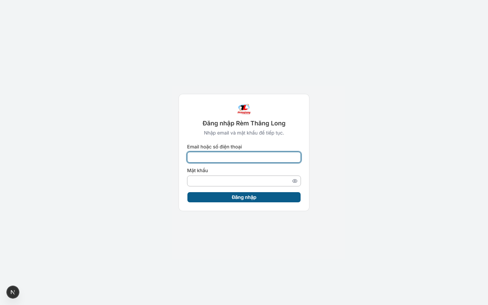

Nếu đây là lần đăng nhập đầu tiên (dùng mật khẩu tạm do Chủ doanh nghiệp cấp), hệ thống sẽ bắt buộc đổi mật khẩu ngay — mật khẩu mới chỉ mình bạn biết, kể cả Chủ doanh nghiệp cũng không xem lại được.

### 1.3. Giao diện tổng quan

Sau khi đăng nhập, trang chủ hiển thị toàn bộ chức năng theo từng nhóm: **Điều hành, Kinh doanh, Vận hành, Danh mục, Hệ thống**. Menu bên trái cũng theo đúng nhóm này.

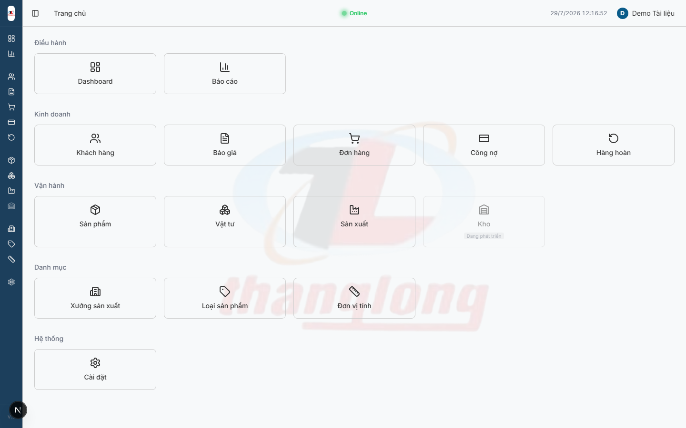

Menu sẽ **tự ẩn/hiện theo quyền của từng người** — ví dụ nhân viên sản xuất sẽ không thấy mục Cài đặt, kế toán sẽ thấy mục Công nợ mà nhân viên kho không cần thấy. Nếu thiếu một mục nào đó, có thể do tài khoản chưa được cấp quyền — liên hệ Chủ doanh nghiệp để kiểm tra.

> **Lưu ý:** mục **Kho** hiện đang hiển thị "Đang phát triển" và chưa dùng được — xem giải thích ở [mục 7.2](#72-vì-sao-menu-kho-hiển-thị-đang-phát-triển).

### 1.4. "Tài khoản của tôi" — trang cá nhân

Ngay dưới mục **Cài đặt** ở menu bên trái có mục **"Tài khoản của tôi"** — ai đăng nhập cũng thấy được, không phân biệt vai trò hay quyền hạn (kể cả người không thấy được mục Cài đặt vẫn thấy mục này).

Trang này hiển thị tên/email/số điện thoại của chính tài khoản đang đăng nhập, cùng 2 số liệu riêng của mình:

- **Doanh số** — đã trừ đúng phần Công ty hỗ trợ hàng hoàn/giảm trừ công nợ, tự lọc theo khoảng ngày, bấm vào để xem thẳng danh sách đơn hàng của mình trong khoảng đó (không tính đơn đã huỷ).
- **Tổng công nợ đang quản lý** — theo các đơn hàng của mình, tính tại thời điểm hiện tại.

Nếu tài khoản có quyền xem số liệu kinh doanh (thường là Chủ doanh nghiệp/Quản trị hệ thống/Kế toán), trang còn hiện thêm **biểu đồ so sánh doanh số với các nhân viên khác** trong cùng kỳ, kèm huy hiệu xếp hạng và tỷ lệ tăng/giảm so với kỳ trước liền kề.

---

## 2. Dành cho Chủ doanh nghiệp

### 2.1. Dashboard — nắm tình hình trong vài giây

Vào menu **Dashboard**, đây là màn hình nên mở đầu mỗi ngày làm việc.

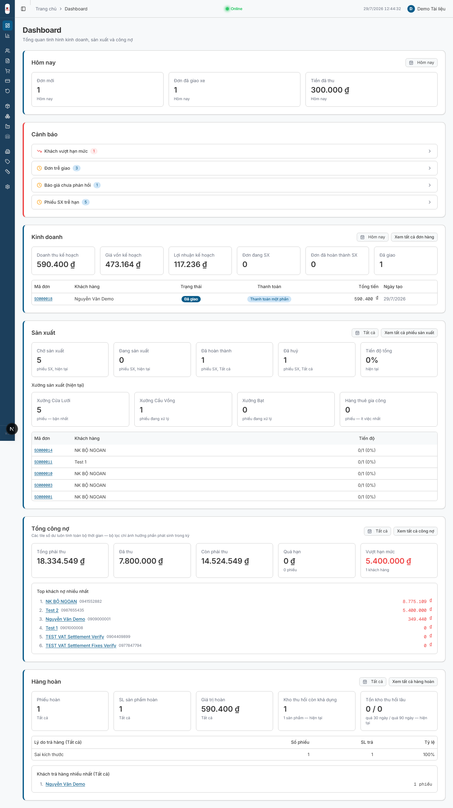

Các khối thông tin từ trên xuống:

- **Hôm nay** — đơn mới, đơn đã giao xe, tiền đã thu trong ngày.
- **Cảnh báo** — khách vượt hạn mức công nợ, đơn trễ giao, báo giá gửi khách lâu chưa phản hồi, phiếu sản xuất trễ hạn. Bấm vào từng dòng để xem danh sách chi tiết.
- **Kinh doanh** — doanh thu/giá vốn/lợi nhuận kế hoạch, số đơn đang sản xuất/đã hoàn thành/đã giao. *(Khối này chỉ Chủ doanh nghiệp và Quản trị hệ thống xem được, vì là số liệu tài chính nhạy cảm.)*
- **Doanh số theo nhân viên** — khối riêng, bộ lọc ngày độc lập (mặc định "Tháng này"), so sánh doanh số từng nhân viên kinh doanh đã phát sinh đơn trong kỳ. *(Cũng chỉ Chủ doanh nghiệp và Quản trị hệ thống xem được, cùng lý do như khối Kinh doanh ở trên — mỗi nhân viên xem số của riêng mình thì vào [mục 1.4](#14-tài-khoản-của-tôi--trang-cá-nhân).)*
- **Sản xuất** — số phiếu theo từng trạng thái, tiến độ theo từng xưởng.
- **Tổng công nợ** — tổng phải thu, đã thu, còn phải thu, quá hạn, vượt hạn mức, Top khách nợ nhiều nhất.
- **Hàng hoàn** — số phiếu hoàn, giá trị hoàn, kho thu hồi còn tận dụng được, top lý do trả hàng.

Dashboard luôn hiển thị dữ liệu **thời gian thực** — không cần bấm làm mới trừ khi muốn chắc chắn số liệu vừa cập nhật.

### 2.2. Báo cáo — phân tích theo kỳ

Vào menu **Báo cáo**. Khác với Dashboard (chỉ xem "hôm nay"), Báo cáo cho phép **chọn khoảng ngày bất kỳ** để phân tích và có thể xuất Excel/PDF.

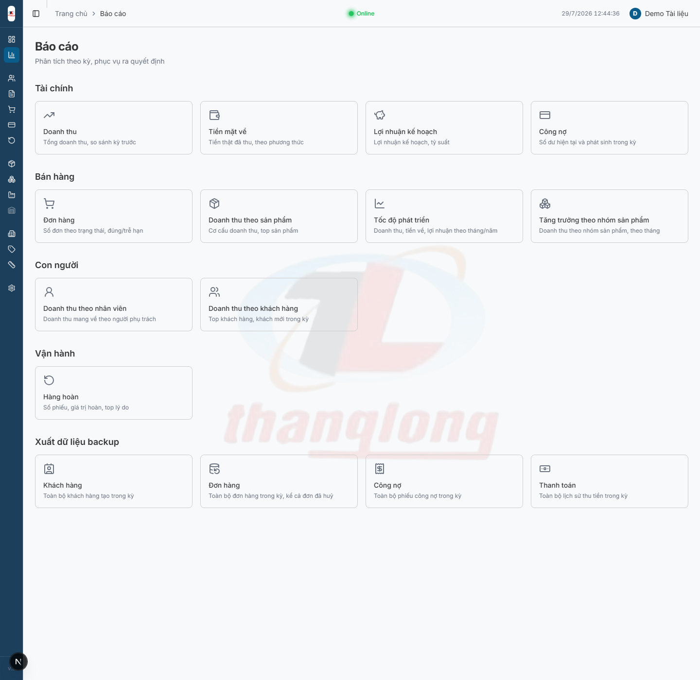

Các nhóm báo cáo:

- **Tài chính** — Doanh thu, Tiền mặt về, Lợi nhuận kế hoạch, Công nợ.
- **Bán hàng** — Đơn hàng, Doanh thu theo sản phẩm, Tốc độ phát triển theo tháng/năm, Tăng trưởng theo nhóm sản phẩm.
- **Con người** — Doanh thu theo nhân viên, Doanh thu theo khách hàng.
- **Vận hành** — Hàng hoàn.
- **Xuất dữ liệu backup** — xuất toàn bộ Khách hàng/Đơn hàng/Công nợ/Thanh toán ra file, dùng làm bản sao lưu thủ công ngoài hệ thống.

Mở một báo cáo bất kỳ, chọn khoảng ngày, xem bảng số liệu (kèm biểu đồ nếu có), rồi bấm **Xuất Excel/PDF** nếu cần lưu hoặc in.

> **Lưu ý quan trọng:** "Lợi nhuận" hiển thị trên toàn hệ thống luôn là **lợi nhuận kế hoạch** (tính tại thời điểm chốt đơn), không phải lợi nhuận thực tế sau khi trừ mọi chi phí phát sinh thật.

### 2.3. Xem lãi/lỗ ngay trên Báo giá

Khi xem một Báo giá (kể cả khi khách chưa duyệt), Chủ doanh nghiệp có nút **"Xem lãi/lỗ"** để biết ngay đơn này lãi bao nhiêu trước khi quyết định có thương lượng thêm với khách hay không. Nhân viên kinh doanh không thấy nút này.

### 2.4. Công nợ tổng quan

Vào menu **Công nợ** để xem toàn bộ công nợ đang mở, gộp theo khách hàng — chi tiết cách dùng ở [mục 3.4](#34-công-nợ--thu-tiền-khách-hàng).

### 2.5. Cài đặt hệ thống

Vào menu **Cài đặt**.

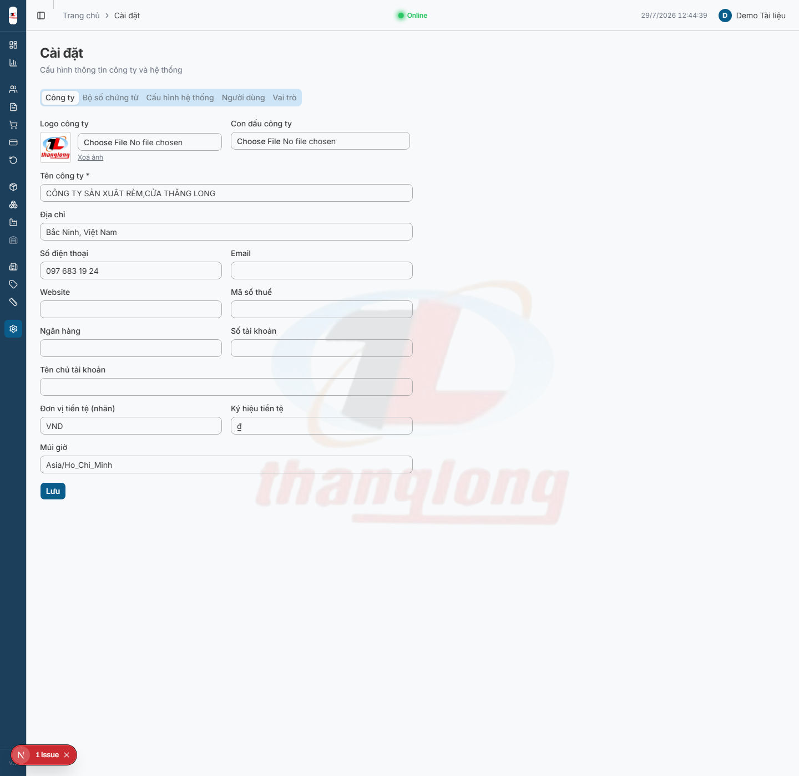

Các tab trong Cài đặt:

- **Công ty** — tên công ty, logo, địa chỉ, số điện thoại, mã số thuế, thông tin ngân hàng... Thông tin này dùng để in trên Báo giá/Đơn hàng/Phiếu nhập kho.
- **Bộ số chứng từ** — tiền tố mã chứng từ (BG cho Báo giá, SO cho Đơn hàng, PO cho Phiếu sản xuất...) và số chữ số.
- **Cấu hình hệ thống** — số ngày cảnh báo công nợ sắp đến hạn, số lượng Top hiển thị trên Dashboard, điều khoản mặc định khi in báo giá...
- **Người dùng** — tạo tài khoản cho nhân viên, gán vai trò, khoá/mở tài khoản.
- **Vai trò** — xem và cấu hình quyền theo từng vai trò (Chủ doanh nghiệp, Quản trị hệ thống, Quản lý, Kinh doanh, Sản xuất, Kho, Kế toán, Chỉ xem).

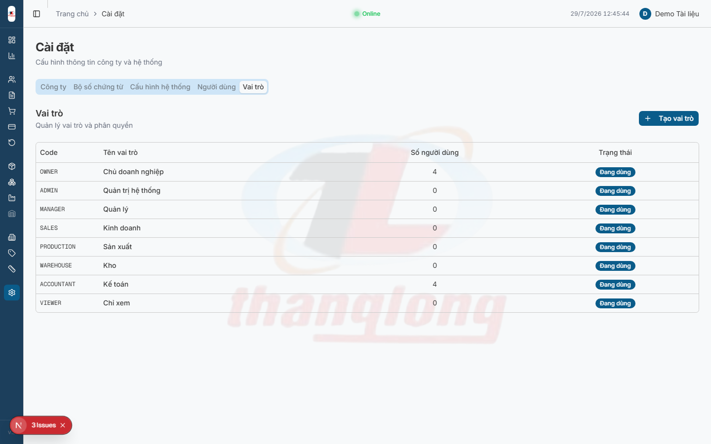

**Tạo tài khoản cho nhân viên mới:** vào tab Người dùng → **Tạo người dùng** → nhập email, tên hiển thị, chọn vai trò. Hệ thống tự sinh mật khẩu tạm; báo miệng hoặc gửi cho nhân viên đó, họ đăng nhập lần đầu sẽ bị bắt đổi mật khẩu ngay và chỉ họ biết mật khẩu thật.

**Lưu ý:** không thể khoá tài khoản Chủ doanh nghiệp cuối cùng đang hoạt động, và không thể tự khoá chính tài khoản đang đăng nhập — đây là cơ chế an toàn để tránh mất quyền truy cập cao nhất vào hệ thống.

---

## 3. Dành cho Kế toán & Kinh doanh

Đây là luồng công việc chính hằng ngày: **Khách hàng → Báo giá → Đơn hàng → Công nợ → Hàng hoàn**.

### 3.1. Quản lý Khách hàng

Vào menu **Khách hàng**.

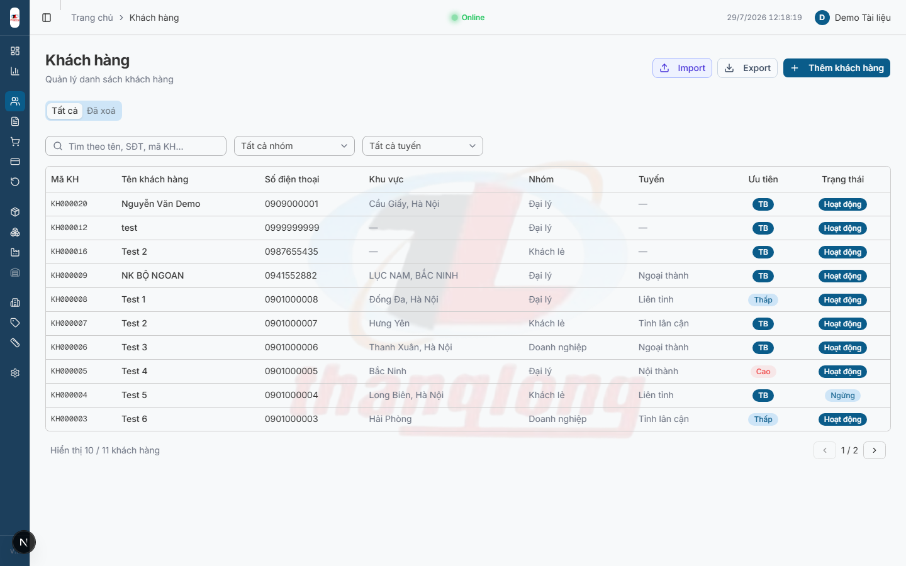

Bấm **Thêm khách hàng** để tạo khách mới. Các trường quan trọng:

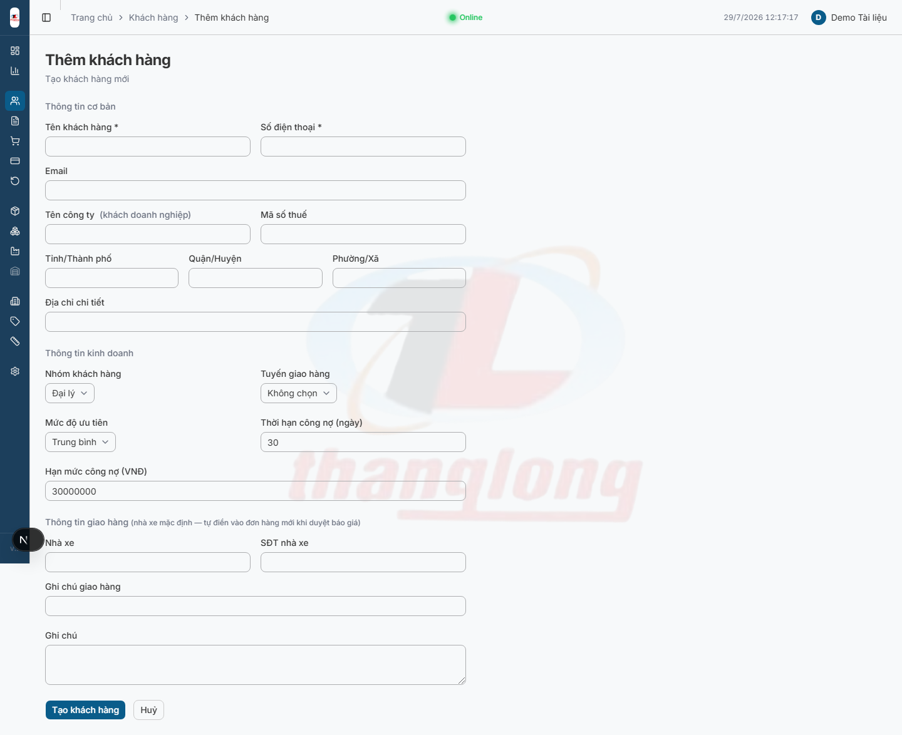

- **Tên, Số điện thoại** — bắt buộc, số điện thoại không được trùng khách khác.
- **Nhóm khách hàng / Tuyến giao hàng** — dùng để lọc và báo cáo.
- **Mức độ ưu tiên, Hạn mức công nợ, Thời hạn công nợ** — mặc định 30 ngày, hạn mức mặc định 0đ (không giới hạn nếu để 0 tuỳ theo cách vận hành thực tế của xưởng).
- **Nhà xe mặc định** — nếu khách hàng luôn đi cùng một nhà xe, điền sẵn ở đây, hệ thống sẽ tự điền vào mỗi đơn hàng mới của khách (vẫn sửa được riêng cho từng đơn).

Sau khi tạo, vào trang chi tiết khách hàng để xem đầy đủ thông tin, ghi nhận thanh toán nhanh, hoặc cấu hình **chiết khấu riêng theo loại sản phẩm** cho khách này.

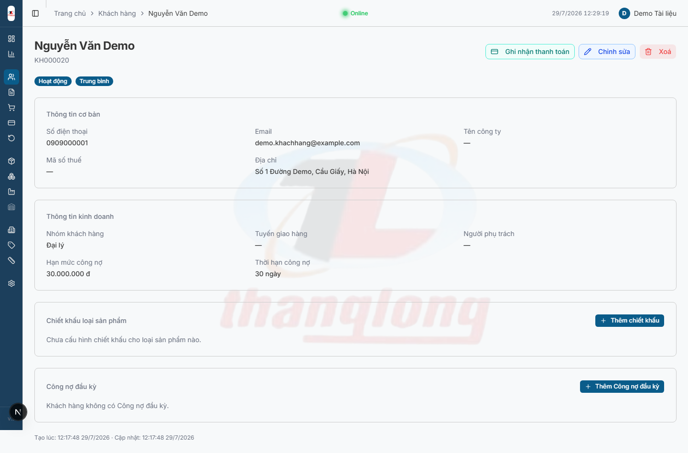

Trong tab **"Đơn hàng"** ở trang chi tiết khách hàng có khối **"Tổng doanh số"** — lọc theo khoảng ngày bất kỳ, tính đúng trên toàn bộ đơn trong khoảng đó (không chỉ những đơn đang hiển thị trên trang hiện tại). Tab **"Công nợ"** có thêm mục con **"Lịch sử giảm trừ/công nợ đầu kỳ"** — liệt kê đầy đủ mọi khoản giảm trừ công nợ của khách này theo thời gian, dù là tự động sinh ra từ hàng hoàn hay giảm trừ thủ công (xem [mục 3.4](#34-công-nợ--thu-tiền-khách-hàng)), lẫn các khoản Công nợ đầu kỳ ([mục 3.6](#36-công-nợ-đầu-kỳ--quyết-toán-vat)).

**Import/Export Excel:** ở trang danh sách có nút Import để nhập nhiều khách hàng cùng lúc từ file Excel (tải file mẫu, điền, tải lên — dòng nào lỗi sẽ được báo rõ, không làm hỏng các dòng còn lại) và Export để xuất danh sách theo bộ lọc đang xem.

### 3.2. Lập Báo giá

Báo giá là điểm khởi đầu của mọi đơn hàng. Vào menu **Báo giá**.

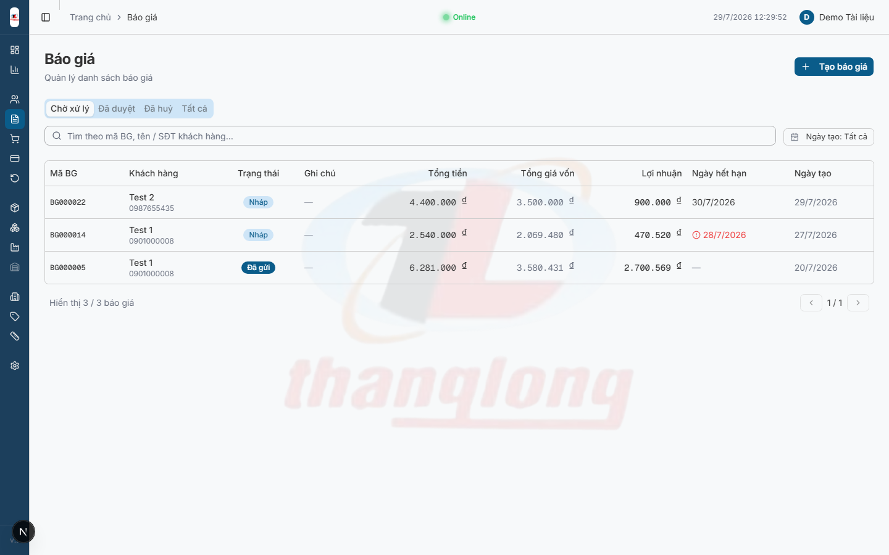

**Bước 1 — Tạo báo giá:** bấm **Thêm báo giá**, chọn khách hàng, có thể điền thêm ngày hết hạn/hạn giao hàng.

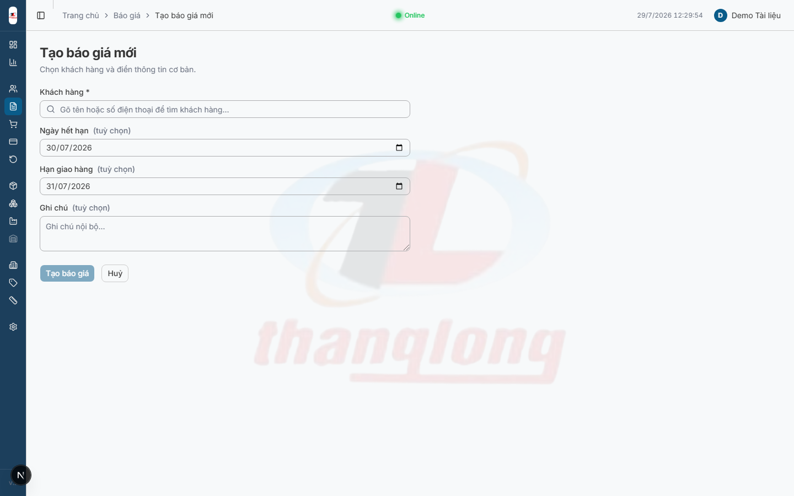

**Bước 2 — Thêm sản phẩm:** trong trang chi tiết báo giá vừa tạo, bấm **Thêm sản phẩm**, gõ tên/mã để tìm sản phẩm, sau đó nhập các thông số (chiều rộng, chiều cao, màu sắc, loại cửa...) — form nhập sẽ tự thay đổi theo từng loại sản phẩm.

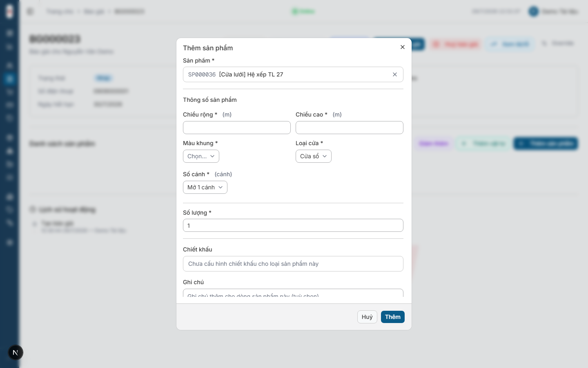

Sau khi bấm **Thêm**, hệ thống **tự tính giá bán, VAT, giá vốn và lợi nhuận ước tính** — người dùng không tự nhập giá bán.

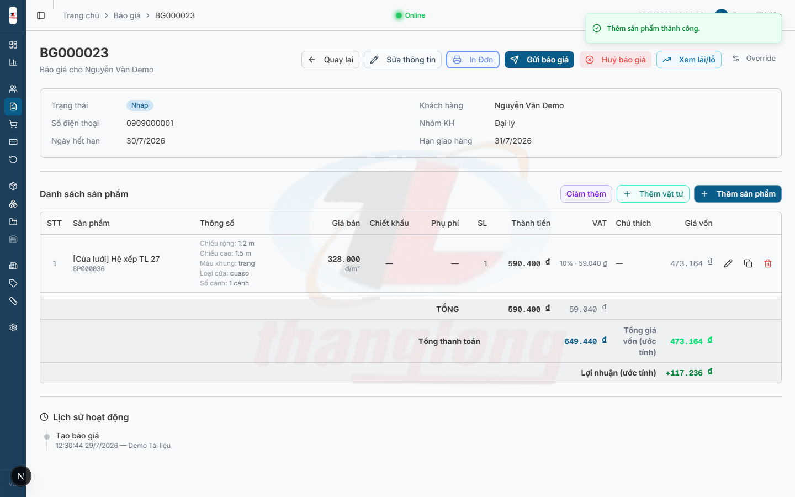

> **Riêng với vài sản phẩm đặc biệt** (ví dụ "Hàng phân phối thêm", "Chi phí Sửa chữa / Lắp đặt" — dùng cho hàng hoá/dịch vụ không sản xuất tại xưởng, không có công thức tính giá cố định), khi thêm sản phẩm sẽ thấy 2 ô **"Đơn giá"** và **"Giá vốn"** cho gõ tay trực tiếp, thay vì hệ thống tự tính như các sản phẩm khác — cứ nhập đúng giá bán và giá vốn thực tế của dòng hàng/dịch vụ đó vào 2 ô này. 2 ô này **không xuất hiện trên bản in gửi khách** (chỉ nội bộ nhìn thấy).

Có thể thêm nhiều dòng sản phẩm, sửa/xoá từng dòng, hoặc bấm **Giảm thêm** để giảm giá cho toàn bộ báo giá (bắt buộc nhập lý do).

**Bước 3 — Gửi báo giá:** khi đã chốt nội dung, bấm **Gửi báo giá** để chuyển trạng thái sang "Đã gửi", sau đó bấm **In Đơn** để tải/in file gửi khách (qua Zalo, email, hoặc in giấy).

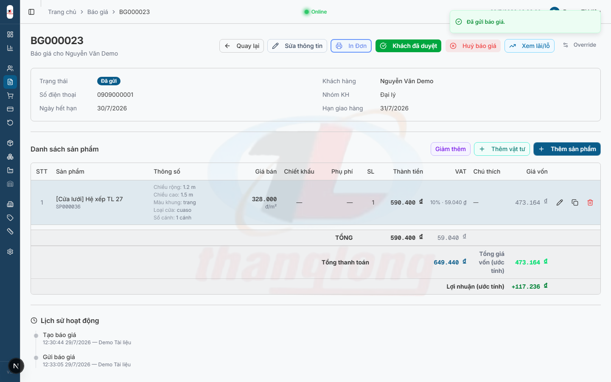

Ở trạng thái Nháp và Đã gửi, vẫn sửa được thoải mái (thêm/sửa/xoá sản phẩm, giá tự tính lại) — sửa xong nhớ in/gửi lại cho khách.

**Bước 4 — Khách đã duyệt:** khi khách đồng ý, bấm **Khách đã duyệt**. Đây là bước quan trọng nhất — hệ thống sẽ **tự động** trong một thao tác duy nhất:

- Sinh **Đơn hàng**
- Sinh **Phiếu sản xuất** cho từng xưởng liên quan
- Chuyển đơn hàng sang trạng thái "Đang sản xuất"
- Ghi nhận công nợ phải thu

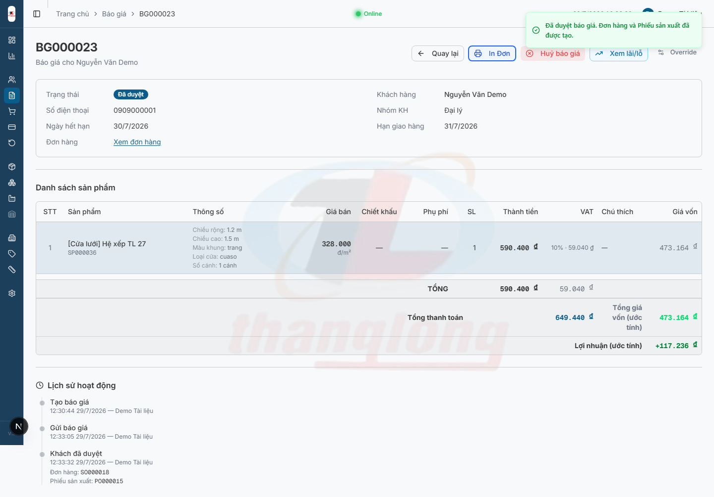

Sau khi Duyệt, báo giá chuyển sang **chỉ xem** (không sửa được nữa) — nếu cần thay đổi, phải huỷ đơn hàng tương ứng (nếu còn được phép) rồi tạo báo giá mới.

**In xác nhận đơn hàng:** sau khi đã có đơn hàng, nút In Đơn sẽ xuất ra bản "Xác nhận đơn hàng" đầy đủ, kèm cả tình hình công nợ (đã thu bao nhiêu, còn phải thu bao nhiêu) để gửi khách đối chiếu.

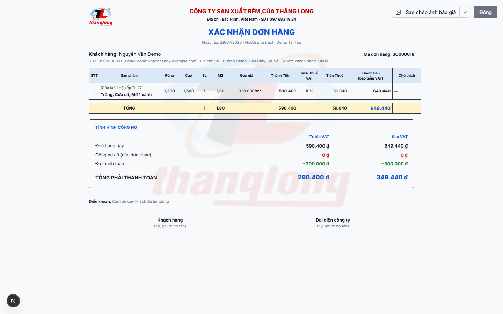

### 3.3. Theo dõi Đơn hàng

Vào menu **Đơn hàng**. Cột **"Tổng tiền"** trên danh sách đã tự trừ đi phần **Công ty hỗ trợ** của các phiếu hoàn thuộc đơn đó (nếu có) — đơn nào có hàng hoàn sẽ có thêm biểu tượng cảnh báo nhỏ trên dòng để dễ nhận ra. Bấm vào một đơn để xem chi tiết, hoặc bấm "Xem đơn hàng" ngay từ báo giá đã duyệt.

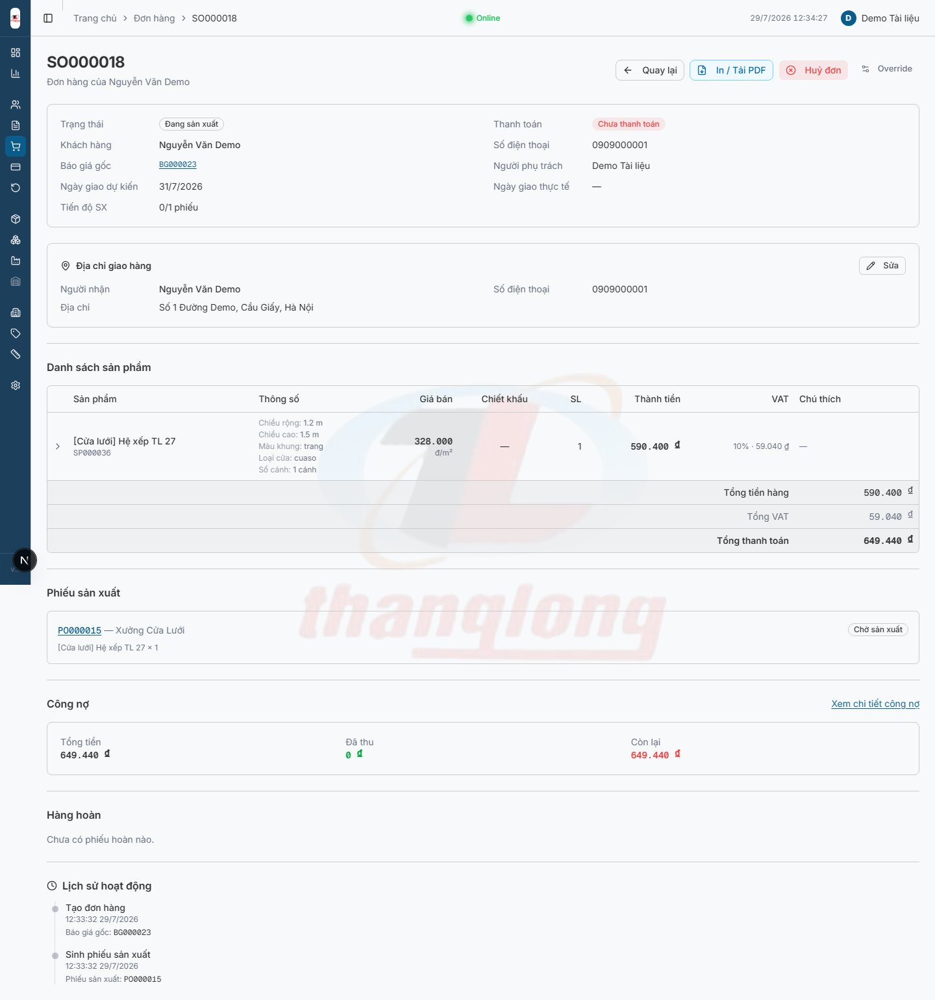

Trang chi tiết đơn hàng cho biết mọi thứ về đơn: sản phẩm, tiến độ sản xuất (bao nhiêu phiếu đã xong), địa chỉ giao hàng, tình hình công nợ, lịch sử hoạt động đầy đủ (Timeline). Đơn hàng là **chứng từ cố định** — sau khi tạo không sửa lại giá/sản phẩm/dòng "Tổng thanh toán" gốc được nữa (trừ địa chỉ giao hàng, có thể sửa qua nút **Sửa** ở khối "Địa chỉ giao hàng" bất cứ lúc nào). Nếu đơn có hàng hoàn, ngay bên dưới dòng "Tổng thanh toán" sẽ hiện thêm 2 dòng màu đỏ: **"Tổng giảm trừ hàng hoàn"** (phần Công ty hỗ trợ cộng dồn của các phiếu hoàn thuộc đơn) và **"Tổng giá trị đơn hàng"** (số thực nhận sau khi trừ) — dòng "Tổng thanh toán" gốc phía trên vẫn giữ nguyên, không bị sửa đè.

Khi tất cả phiếu sản xuất của đơn đã hoàn thành, hệ thống **tự động** chuyển trạng thái đơn sang "Đã hoàn thành SX" — không cần thao tác gì thêm. Lúc này màn hình sẽ xuất hiện thêm 2 nút:

- **Gửi xe** — khi hàng đã xuất đi giao khách.
- **Khách đã nhận** — sau khi khách xác nhận đã nhận hàng.

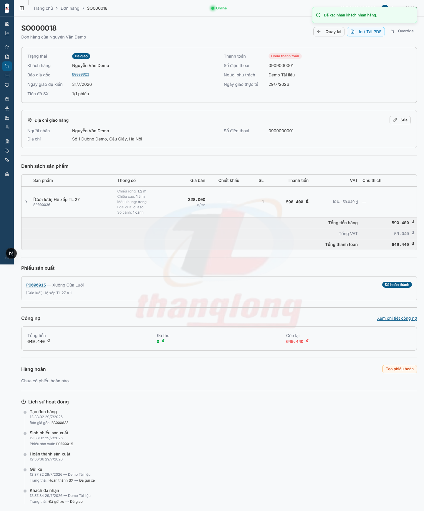

**Tạo phiếu hoàn:** bấm nút **Tạo phiếu hoàn** ngay tại trang chi tiết đơn — có thể tạo ở **bất kỳ trạng thái nào của đơn**, kể cả khi đơn chưa giao xong, không bắt buộc phải đợi tới sau "Khách đã nhận" (chỉ không tạo được khi đơn đã **Huỷ**). Xem chi tiết cách tạo và ảnh hưởng tới công nợ ở [mục 3.5](#35-xử-lý-hàng-hoàn).

**Huỷ đơn hàng:** chỉ huỷ được khi chưa có phiếu sản xuất nào bắt đầu làm (còn "Chờ sản xuất"). Nếu đơn đã thu cọc, hệ thống sẽ cảnh báo và tự đóng công nợ khi huỷ — việc hoàn tiền cho khách xử lý ngoài hệ thống (chuyển khoản/tiền mặt trực tiếp), không tự động qua ERP.

### 3.4. Công nợ — thu tiền khách hàng

Vào menu **Công nợ**.

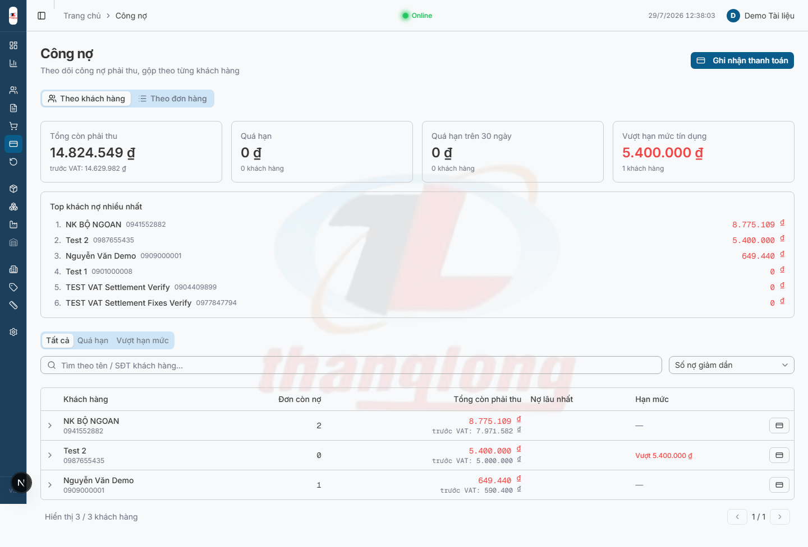

Màn hình mặc định gộp công nợ **theo khách hàng** — bấm vào một khách để xem chi tiết từng đơn còn nợ của khách đó. Có thể chuyển sang xem **Theo đơn hàng** nếu cần tra theo mã đơn.

**Ghi nhận thanh toán:** bấm nút **Ghi nhận thanh toán** ở góc trên, chọn khách hàng, nhập số tiền khách trả. Hệ thống mặc định **trừ theo thứ tự đơn cũ trước (FIFO)** nếu khách có nhiều đơn còn nợ, nhưng vẫn cho sửa tay để cấn trừ đúng theo đơn cụ thể nếu cần.

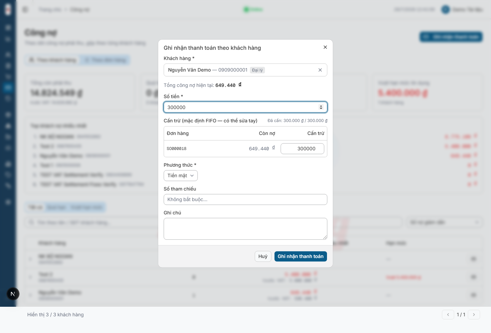

Sau khi ghi nhận, số tiền còn nợ tự động cập nhật ngay:

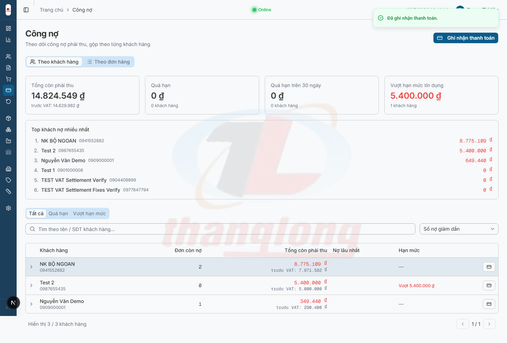

Một vài lưu ý:

- Có thể thu **nhiều lần** cho cùng một đơn (ví dụ đặt cọc trước, thanh toán nốt khi nhận hàng).
- Công nợ phát sinh **ngay khi đơn hàng được tạo** (từ lúc khách duyệt báo giá), không đợi tới khi giao hàng — vì xưởng thường cần thu cọc trước khi sản xuất.
- Nếu khách **trả tiền mặt và không lấy hoá đơn**, kế toán có thể bấm **"Đóng công nợ (không xuất hoá đơn)"** ngay tại trang chi tiết công nợ của đơn đó — hệ thống sẽ coi khoản VAT còn lại là không cần theo dõi nữa. Nếu sau này khách quay lại xin hoá đơn, xử lý qua **Quyết toán VAT** — xem [mục 3.6](#36-công-nợ-đầu-kỳ--quyết-toán-vat), không cần mở lại công nợ cũ.
- Nếu lỡ ghi nhận nhầm một khoản thu, dùng chức năng **Hoàn tác (Reverse)** trên đúng phiếu thu đó — hệ thống không cho sửa/xoá trực tiếp một khoản thu đã ghi, mà tạo một bút toán đảo ngược để giữ đúng lịch sử.

**Giảm trừ công nợ (không qua thu tiền thật):** ở trang chi tiết công nợ của một đơn hàng, có nút **Giảm trừ công nợ** — dùng khi cần giảm bớt số tiền khách còn nợ vì một lý do khác ngoài thu tiền (ví dụ thoả thuận giảm giá sau, xử lý khiếu nại...), **không tạo phiếu thu, không tính vào dòng tiền mặt đã thu**. Bấm vào, nhập số tiền và **bắt buộc nhập lý do** — hệ thống trừ thẳng vào số còn nợ và ghi lại đầy đủ trong khối "Lịch sử điều chỉnh công nợ" ngay bên dưới, không có nút xoá/sửa lại sau khi đã tạo. Toàn bộ các khoản giảm trừ này (kể cả phần tự động sinh ra khi tạo phiếu hoàn — xem [mục 3.5](#35-xử-lý-hàng-hoàn)) cũng xem lại được ở tab **"Lịch sử giảm trừ/công nợ đầu kỳ"** trên trang chi tiết Khách hàng.

### 3.5. Xử lý Hàng hoàn

Vào menu **Hàng hoàn**, hoặc bấm **Tạo phiếu hoàn** ngay từ trang chi tiết đơn hàng — có thể tạo ở **bất kỳ trạng thái nào của đơn** (không bắt buộc đợi tới khi đơn đã giao xong), chỉ trừ đơn đã **Huỷ**.

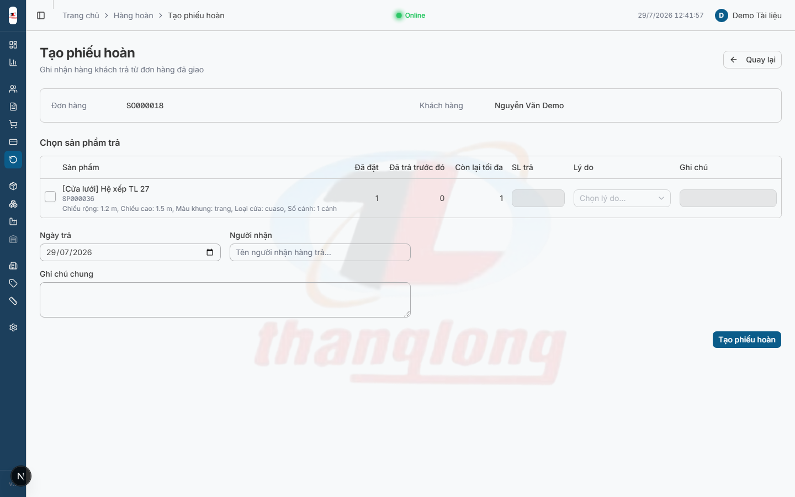

Tick chọn sản phẩm khách trả, nhập số lượng trả (có thể trả một phần, ví dụ đặt 5 chỉ trả lại 2), chọn lý do trả hàng, điền người nhận hàng trả. Sau khi hệ thống tính ra **giá trị hàng trả**, phải phân bổ rõ giá trị này thành 2 phần:

- **Phí khách** — phần khách vẫn phải chịu (ví dụ lỗi do khách chọn sai, hàng đã cắt theo yêu cầu riêng không dùng lại được). Có thể nhập theo **tỷ lệ %** hoặc nhập thẳng số tiền.
- **Công ty hỗ trợ** — phần còn lại, xưởng chịu thay khách (tự tính = giá trị hàng trả − Phí khách). Khi phần này lớn hơn 0, hệ thống **bắt buộc nhập lý do**.

Bấm **Tạo phiếu hoàn**.

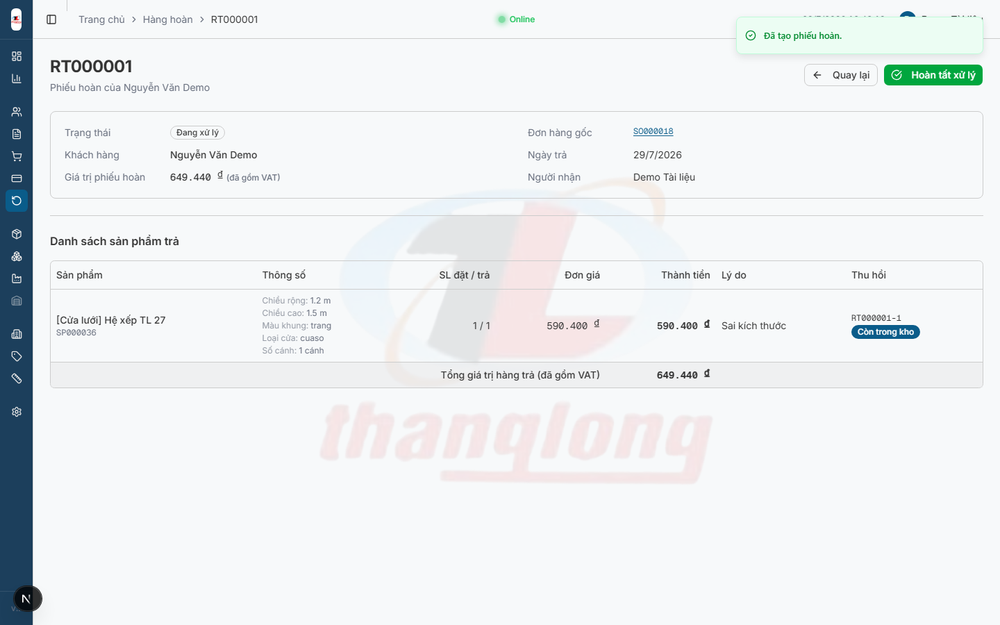

Ngay khi tạo xong, nếu có phần **Công ty hỗ trợ**, hệ thống **tự động giảm công nợ tương ứng của khách** — không cần thao tác thêm, cũng không cần kế toán chủ động vào Công nợ chỉnh tay. (Trường hợp việc giảm trừ tự động không thực hiện được — ví dụ số còn nợ không đủ để trừ — màn hình sẽ cảnh báo và cho bấm **Giảm trừ công nợ** thủ công ngay tại đó.) Khoản giảm công nợ này xem lại được ở khối "Lịch sử điều chỉnh công nợ" trên trang chi tiết Công nợ, hoặc tab **"Lịch sử giảm trừ/công nợ đầu kỳ"** trên trang Khách hàng — xem [mục 3.4](#34-công-nợ--thu-tiền-khách-hàng).

Sản phẩm nhận về sẽ tự động vào **Kho thu hồi** với trạng thái "Còn trong kho" — có thể đánh dấu **Đã sử dụng** (tận dụng cho đơn khác/cắt mẫu) hoặc **Đã thanh lý** khi không dùng được nữa.

Khi đã xử lý xong với khách (đồng ý đổi/trả, thoả thuận xong), bấm **Hoàn tất xử lý** để đóng phiếu.

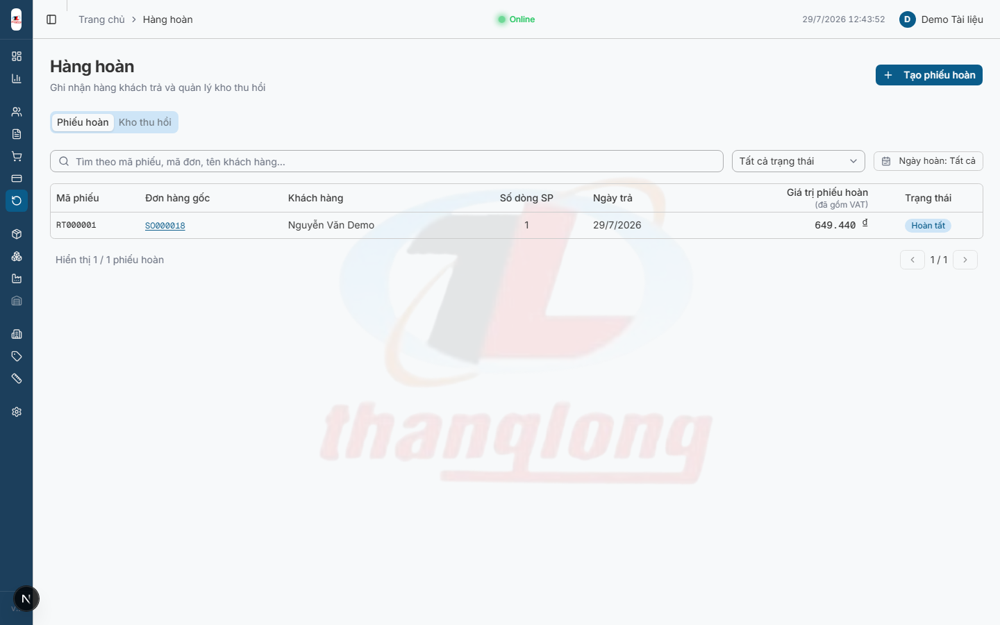

**Lưu ý quan trọng:** phiếu hoàn là **chứng từ cố định** — sau khi tạo không sửa lại được tỷ lệ "Phí khách"/"Công ty hỗ trợ" nữa, kể cả sau khi bấm "Hoàn tất xử lý". Nếu tình huống với khách thay đổi (thoả thuận lại phần chịu phí), báo kế toán **tạo thêm một khoản Giảm trừ công nợ riêng** ([mục 3.4](#34-công-nợ--thu-tiền-khách-hàng)) để bù chênh lệch, không sửa lại phiếu hoàn cũ. "Doanh thu" trên Dashboard/Báo cáo cũng đã tự trừ đúng phần Công ty hỗ trợ này, không cần cộng trừ tay.

### 3.6. Công nợ đầu kỳ & Quyết toán VAT

Đây là 2 tính năng ít dùng hằng ngày, **không có trên menu chính** — chỉ vào được từ trang chi tiết Khách hàng hoặc trang chi tiết Công nợ. Dùng cho 2 tình huống đặc biệt sau.

**Công nợ đầu kỳ — khi khách hàng có nợ cũ từ trước khi dùng phần mềm:**

Vào trang chi tiết một Khách hàng, kéo xuống khối **"Công nợ đầu kỳ"**, bấm **Thêm Công nợ đầu kỳ**. Nhập **Số tiền trước VAT** (bắt buộc) và **Số tiền sau VAT** (để trống thì mặc định bằng số trước VAT), kèm ghi chú (ví dụ "Nợ cũ trước khi dùng phần mềm"). Khoản này **không gắn với Đơn hàng/Phiếu sản xuất** nào cả — chỉ là một con số nợ nhập tay để hệ thống theo dõi tiếp phần còn thu được của khách.

- Muốn **giảm bớt số nợ** (khách đã trả một phần bằng tiền mặt ngoài hệ thống, hoặc xoá nợ khó đòi): bấm **Giảm trừ**, nhập số tiền và **bắt buộc nhập lý do** — không có nút xoá/sửa trực tiếp, mọi thay đổi đều lưu lại lý do rõ ràng.
- Muốn **xuất hoá đơn** cho khoản nợ cũ này khi khách yêu cầu: bấm **Phục dựng hoá đơn** — xem tiếp bên dưới.

**Quyết toán VAT — khi cần xuất hoá đơn cho khoản đã thu tiền mặt trước đó:**

Áp dụng cho 2 trường hợp: (1) đơn hàng đã "Đóng công nợ (không xuất hoá đơn)" ở [mục 3.4](#34-công-nợ--thu-tiền-khách-hàng) nay khách quay lại xin hoá đơn, hoặc (2) Công nợ đầu kỳ ở trên nay cần xuất hoá đơn.

- Từ **trang chi tiết Công nợ** đã đóng theo diện "không xuất hoá đơn": chọn 1 hoặc nhiều khoản của cùng một khách để gộp chung, xem tổng tiền VAT sẽ đưa vào, bấm **Tạo Quyết toán VAT**.
- Từ **Công nợ đầu kỳ** (nút **Phục dựng hoá đơn**): vì khoản nợ cũ không có sẵn danh sách sản phẩm, màn hình sẽ cho kế toán **tự thêm các dòng sản phẩm thật** (đúng tên, số lượng, đơn giá) tương ứng với khoản nợ đó, chỉ để tính ra đúng số tiền/VAT cần xuất hoá đơn — thao tác này **không tạo Đơn hàng hay Phiếu sản xuất** mới.

Sau khi tạo, Quyết toán VAT có mã riêng, xem lại và in được như một chứng từ độc lập.

---

## 4. Dành cho Sản xuất

Công việc của xưởng sản xuất chỉ xoay quanh **Phiếu sản xuất**, được hệ thống tự sinh ngay khi báo giá được khách duyệt — không cần tự tạo phiếu.

Vào menu **Sản xuất** để xem danh sách phiếu, lọc theo xưởng/trạng thái/ngày.

Bấm vào một phiếu để xem chi tiết: sản phẩm cần làm, thông số kỹ thuật, số lượng.

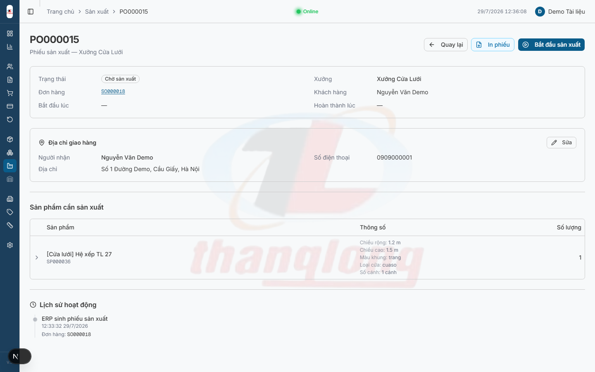

**Bước 1 — Bắt đầu sản xuất:** khi xưởng bắt tay vào làm, bấm **Bắt đầu sản xuất**.

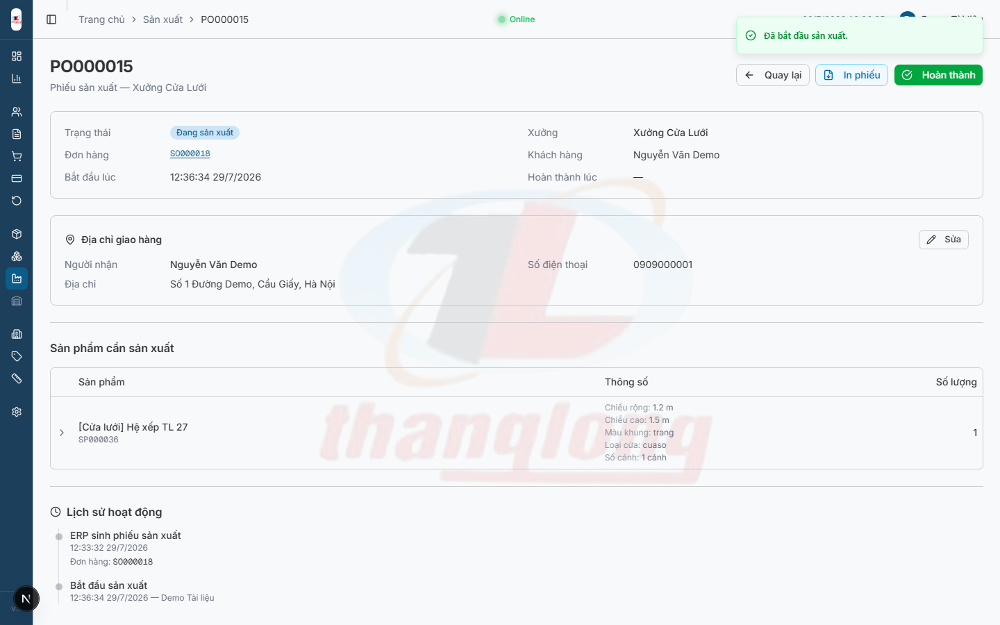

**Bước 2 — Hoàn thành:** khi làm xong, bấm **Hoàn thành**.

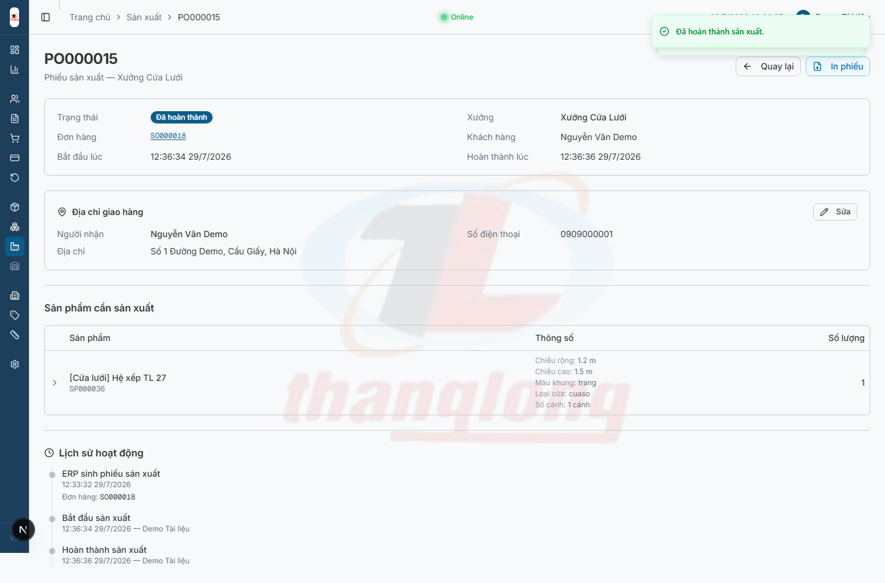

Ngay khi hoàn thành, hệ thống tự cập nhật tiến độ trên Đơn hàng liên quan — nếu đây là phiếu cuối cùng của đơn, đơn hàng sẽ tự chuyển sang "Đã hoàn thành SX" để bên kinh doanh biết và tiến hành gửi xe.

**Lưu ý:** một phiếu chỉ hoàn thành được **một lần**, không quay lại được trạng thái trước đó. Nếu bấm nhầm, báo lại cho Quản trị hệ thống xử lý — đây là thao tác cần chỉnh trực tiếp trong hệ thống, không có nút "Hoàn tác" giống như bên Công nợ.

---

## 5. Quản lý Sản phẩm & Bảng giá (nâng cao)

> Phần này dành cho người phụ trách cấu hình sản phẩm (thường là Chủ doanh nghiệp hoặc người được giao quản trị danh mục sản phẩm). Công việc hằng ngày (báo giá, đơn hàng, sản xuất) **không cần đụng tới phần này** — chỉ cần dùng khi thêm sản phẩm mới hoặc đổi giá/định mức vật tư.

Vào menu **Sản phẩm** để xem danh mục.

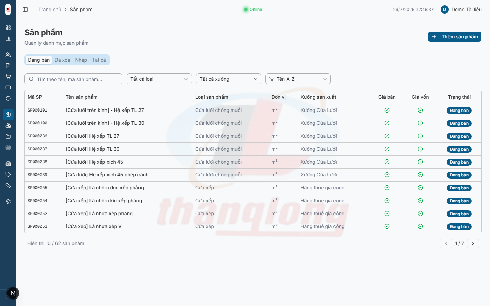

Mỗi sản phẩm hoạt động theo mô hình **"khách nhập thông số, hệ thống tự tính"** — không có kích thước cố định. Để một sản phẩm dùng được cho báo giá, cần cấu hình đủ:

1. **Loại sản phẩm** — vd Rèm cầu vồng, Cửa lưới chống muỗi (menu **Loại sản phẩm**).
2. **Đơn vị tính** — vd m², bộ, cái (menu **Đơn vị tính**).
3. **Thông số sản phẩm** — các trường khách sẽ nhập khi báo giá (chiều rộng, chiều cao, màu sắc...).
4. **Quy tắc báo giá** — công thức tính giá bán từ thông số đã nhập.
5. **Định mức vật liệu** — công thức tính lượng nguyên vật liệu cần dùng, dùng để tính giá vốn (độc lập hoàn toàn với giá bán).

Sản phẩm mới tạo ở trạng thái **Nháp** — chỉ chuyển được sang **Đang bán** (dùng được cho báo giá) khi đã có đủ Thông số + Quy tắc báo giá + Định mức vật liệu.

**Nguyên tắc quan trọng: không sửa lại quy tắc/định mức cũ.** Khi cần đổi giá bán hoặc đổi định mức vật liệu, luôn **tạo phiên bản (Version) mới** rồi kích hoạt — các báo giá/đơn hàng đã tạo trước đó vẫn giữ nguyên giá đã tính theo phiên bản cũ, không bị ảnh hưởng. Đây là nguyên tắc cốt lõi giúp chứng từ cũ không bao giờ tự đổi số liệu.

Vì đây là phần cấu hình ảnh hưởng tới toàn bộ hệ thống, nên **cẩn trọng khi chỉnh sửa** và có thể dùng chức năng "Preview giá bán" / "Preview giá vốn" để kiểm tra trước khi kích hoạt phiên bản mới.

---

## 6. Quản lý Vật tư & Danh mục nền tảng (nâng cao)

> Cũng như mục 5, phần này dành cho người phụ trách cấu hình sản phẩm. Công việc hằng ngày không cần đụng tới.

### 6.1. Vật tư

Vào menu **Vật tư** (nhóm Vận hành). Đây là danh mục nguyên vật liệu dùng để tính **giá vốn** sản phẩm qua Định mức vật liệu ([mục 5](#5-quản-lý-sản-phẩm--bảng-giá-nâng-cao)) — độc lập hoàn toàn với giá bán.

Bảng danh sách có thể lọc theo tên/mã, trạng thái, xưởng sản xuất, hoặc chỉ xem vật tư đang cho phép bán lẻ. Các cột chính: Mã vật tư (tự sinh dạng `NL000001`...), Tên, Đơn vị, **Giá nhập** (giá mặc định mới nhất — xem lịch sử đầy đủ ở trang chi tiết), Giá bán lẻ, Tồn kho (hiện để trống vì module Kho chưa kích hoạt — xem [mục 7.2](#72-vì-sao-menu-kho-hiển-thị-đang-phát-triển)), cột **Cho phép bán lẻ** (bật/tắt trực tiếp ngay trên bảng), cột **Xưởng** (bấm để chọn nhanh nhiều xưởng dùng vật tư này mà không cần mở trang sửa).

**Thêm vật tư mới:** bấm **Thêm vật tư**, nhập Tên và Đơn vị tính (bắt buộc), Tồn kho tối thiểu (tuỳ chọn, để hệ thống cảnh báo sau này khi bật Kho). Nếu vật tư này **cũng bán trực tiếp cho khách** (không chỉ dùng để sản xuất), bật khối **"Cho phép bán lẻ"** — khi đó nhập thêm Giá bán lẻ (bắt buộc), Đơn vị bán lẻ (nếu khác đơn vị gốc thì phải nhập thêm **Hệ số quy đổi**, ví dụ "1 mét = 0,35 kg"), %VAT bán lẻ (mặc định 10%). Có thể gán vật tư cho một hoặc nhiều **Xưởng sản xuất** (chỉ để lọc, không bắt buộc).

> **Lưu ý:** form tạo mới **không có ô nhập Giá nhập** — giá nhập được quản lý riêng ở trang chi tiết vật tư (sau khi tạo xong), vì giá nhập thường thay đổi theo thời gian và hệ thống cần lưu lại **lịch sử giá** để tính đúng giá vốn cho từng báo giá theo đúng thời điểm.

**Trang chi tiết vật tư:** xem đầy đủ thông tin đã cấu hình, và khối **Lịch sử giá nhập** — mỗi lần giá nhà cung cấp đổi, bấm thêm 1 dòng giá mới kèm ngày hiệu lực, hệ thống tự đóng giá cũ lại (không sửa đè lên giá cũ, giữ đúng lịch sử). Có nút **Ngừng sử dụng / Kích hoạt** và **Chỉnh sửa**.

**Import/Export Excel:** ở trang danh sách có nút **Xuất Excel** (xuất đúng theo bộ lọc đang xem) và **Nhập từ Excel** — tải file, sửa các cột Tên/Đơn vị/Giá nhập/Giá bán lẻ/Cho phép bán lẻ/Trạng thái (chọn qua dropdown có sẵn, không gõ tự do để tránh sai chính tả), tải lên lại. Hệ thống hiện bảng đối chiếu **chỉ những dòng thực sự có thay đổi** trước khi hỏi xác nhận, không ghi mù vào hệ thống. Riêng cột **Xưởng không sửa được qua Excel** (vì 1 vật tư có thể thuộc nhiều xưởng cùng lúc, không hợp với 1 ô Excel) — muốn đổi xưởng, dùng nút chọn nhanh ngay trên bảng hoặc vào trang sửa.

### 6.2. Loại sản phẩm

Vào menu **Loại sản phẩm** (nhóm Danh mục) — dùng để phân nhóm sản phẩm cho báo cáo và một số cấu hình theo nhóm (ví dụ mức chiết khấu riêng theo loại sản phẩm ở [mục 3.1](#31-quản-lý-khách-hàng)). Bấm **Thêm** để tạo loại mới (chỉ cần nhập Tên), bấm vào badge trạng thái để Ẩn/Hiện một loại không dùng nữa. Không xoá được nếu đang có sản phẩm thuộc loại đó.

### 6.3. Đơn vị tính

Vào menu **Đơn vị tính** (nhóm Danh mục) — ví dụ m², Bộ, Cái, Khoản... Chỉ cần đặt tên, không có trạng thái Ẩn/Hiện. Không xoá được nếu đang có sản phẩm/vật tư dùng đơn vị đó.

### 6.4. Xưởng sản xuất

Vào menu **Xưởng sản xuất** (nhóm Danh mục) — đại diện cho từng tổ/xưởng thực tế đảm nhận sản xuất (ví dụ "Xưởng Cầu Vồng", "Xưởng Cửa Lưới"). Mỗi sản phẩm được gán đúng 1 Xưởng sản xuất chịu trách nhiệm — khi đơn hàng phát sinh, **Phiếu sản xuất tự động chia theo đúng xưởng** của từng sản phẩm trong đơn, giúp bên [Sản xuất](#4-dành-cho-sản-xuất) lọc đúng việc của tổ mình. Bấm **Thêm** để tạo xưởng mới (Tên + Mô tả tuỳ chọn), mã xưởng tự sinh. Không xoá được nếu đang có sản phẩm gán vào xưởng đó.

---

## 7. Phụ lục

### 7.1. Quên mật khẩu

Hệ thống hiện chưa hỗ trợ tự lấy lại mật khẩu qua email. Nếu quên mật khẩu, liên hệ Chủ doanh nghiệp hoặc người có quyền Quản trị hệ thống để được cấp lại mật khẩu tạm (vào **Cài đặt → Người dùng**, chỉnh sửa tài khoản đó) — đăng nhập lần đầu bằng mật khẩu tạm sẽ bắt buộc đổi ngay.

### 7.2. Vì sao menu Kho hiển thị "Đang phát triển"

Ở phiên bản hiện tại, xưởng chưa có nhu cầu quản lý tồn kho nguyên vật liệu trên phần mềm nên tính năng Kho **tạm thời chưa được kích hoạt** (menu hiển thị mờ, không bấm được). Việc sản xuất vẫn diễn ra bình thường — hệ thống không kiểm tra tồn kho khi bắt đầu sản xuất. Khi nào xưởng cần dùng, đây sẽ là một hạng mục triển khai riêng (có tính phí) để bật lại tính năng này.

### 7.3. Xử lý sự cố thường gặp

| Tình huống | Cách xử lý |
|---|---|
| Không thấy một menu nào đó | Tài khoản có thể chưa được cấp quyền tương ứng — liên hệ Chủ doanh nghiệp kiểm tra ở Cài đặt → Vai trò |
| Không tạo được đơn hàng mới cho khách | Kiểm tra khách hàng có đang ở trạng thái "Ngừng hoạt động" không |
| Không Duyệt được báo giá | Kiểm tra sản phẩm trong báo giá còn "Đang bán" không, và giá đã tính có bị cảnh báo lệch phiên bản không — nếu có, bấm "Tính lại giá" trước khi Duyệt |
| Không Huỷ được đơn hàng | Chỉ huỷ được khi tất cả phiếu sản xuất liên quan còn "Chờ sản xuất" — nếu đã có xưởng bắt đầu làm thì không huỷ được nữa |
| Ghi nhầm một khoản thu tiền | Không sửa/xoá trực tiếp — vào đúng phiếu thu đó và dùng chức năng Hoàn tác (Reverse) |
| Không tạo được Vật tư/Loại sản phẩm/Đơn vị tính/Xưởng mới | Kiểm tra tên có bị trùng với mục đã có (kể cả mục đang Ẩn) không |
| Cần hỗ trợ thêm | Liên hệ đơn vị phát triển phần mềm |
